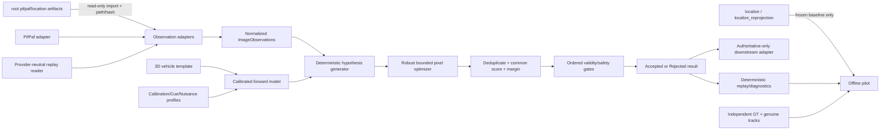

# Haware Localization Accuracy — Technical Design

## Overview

This design replaces the stale role-constraint-graph and projected-point fitting proposal with a feasibility-first, calibrated **CCTV image-space forward-model optimizer**. Production implementation is confined to `trafficlab-project/**`. Root `pifpaf/**` and `location/**` are read-only legacy inputs whose repository-relative path and content digest are recorded when imported; production code never imports, writes, or dispatches into those trees.

Existing `HawareLocalizer.localize()` and `localize_reprojection()` remain frozen comparison paths only. `localize()` with its applied local `Q[:, 0] = -Q[:, 0]` handedness correction and configured spread behavior is the Corrected Legacy Baseline. Neither method is reused as the new optimizer core. Optimizer-disabled dispatch preserves the baseline output and legacy schema exactly.

The new core estimates one planar vehicle pose from the original CCTV pixels. It transforms the versioned Apollo-24-compatible 3D template by satellite/world position and heading, applies bounded height, dimension, and authorized calibration nuisances, predicts distorted CCTV pixels, and minimizes robust pixel residuals. It never uses independently inverse-lifted per-keypoint ground targets, projected-point Procrustes, a `RoleConstraintGraph`, or a `wheel_only`/`wheel_weighted` mode tree.

Wheel evidence is a preference, not authority: eligible `h=0` wheel/ground-contact subsets are generated first and anchor the first initialization, but eligible non-wheel subsets are always generated as well. Normal, front/rear-reversed, and explicit 180-degree semantic paths compete under one score. Any wheel- or non-wheel-seeded valid hypothesis may win. Ambiguous, unsupported, ill-conditioned, or uncertain results are rejected rather than converted into authoritative coordinates.

The first deliverable is the smallest credible offline pilot: stored provider-neutral observations for `kee-cc` and `taoyuan-tc`, independent ground truth, genuine tracker identities, leak-free pilot/held-out partitions, a corrected frozen baseline, the full optimizer, wheel-disabled/non-wheel-disabled initialization ablations, and one diagnostic candidate arm (`wheel_weighted_procrustes`, the 2026-08-10 proposal) that is measured but never decides anything. `taipei-cm` is diagnostic-only. The current checked-in evidence must report `insufficient_data`; it cannot support a success claim.

Three facts shape everything below and were missing from the previous revision of this design (2026-08-16 critique):

1. **Production today is the legacy baseline, and it will stay so until held-out `go`.** Its status vocabulary (`ok`, `extrapolated`, `failed_insufficient_kp`; `ambiguous_heading` from `localize_reprojection()`) is therefore bound to coordinate authority by a standalone `LegacyStatusPolicy` (`legacy-localize-v1`, §6) that exists before any pilot. Without it, `authoritative_position()` on a real teammate record returns `None` and every real-video scene bundle silently loses `position_m` — verified against the working tree on 2026-08-16.
2. **The product's last mile is `tools/build_scene.py` → `scenes/<code>/trajectory.json` → Three.js**, which sits outside `trafficlab-project/**`. §6 binds it explicitly (missing-position rule, scene segmentation, `localization_counts`, pass-rate refusal) so the quality gates actually reach the collision conclusion.
3. **The system is an offline background batch.** A whole video may take minutes; the `BatchRuntimeEnvelope` (`10 s / s`, or 600 s for a 60 s source video; Requirement 13) is what hypothesis budgets are chosen against. Nothing here is real-time.

### Repository findings that constrain the design

- [`trafficlab/motion/haware_localization.py`](../../../trafficlab-project/trafficlab/motion/haware_localization.py) is the current canonical implementation and defines the preserved body axes (`+x` left, `+y` up, `+z` rear), Apollo-24 indices, wheel indices `(7, 8, 18, 19)`, heading convention, handedness correction, and spread diagnostic.
- [`trafficlab/projection/g_projection.py`](../../../trafficlab-project/trafficlab/projection/g_projection.py) already implements the required forward semantics in `sat_to_cctv(x, y, h)`: camera-radial parallax, inverse homography, and lens distortion. It does not accept an immutable calibration snapshot per call, bounded calibration deltas, vectorized points, or Jacobians; those are required extensions, not assumed APIs.
- [`scripts/eval_haware_replay.py`](../../../trafficlab-project/scripts/eval_haware_replay.py) couples PifPaf inference, YOLO association, localization, and TrafficLab replay output. IDs synthesized as `500 + detection_index` are explicitly frame-local and therefore pseudo tracks. The pilot must read stored observations without rerunning either detector.
- [`trafficlab/io/replay_writer.py`](../../../trafficlab-project/trafficlab/io/replay_writer.py) writes ordinary indented gzip JSON and has no schema reader or canonical-byte guarantee. A narrow MVP observation replay reader/writer must be added rather than pretending the existing writer already satisfies exact replay.
- [`scripts/filter_and_enrich_output.py`](../../../trafficlab-project/scripts/filter_and_enrich_output.py) derives position and velocity directly from `sat_coords` and bridges gaps without checking localization authority. It requires an explicit accepted-result adapter and segment-break behavior.
- The handedness decision record documents why the baseline correction remains local to the fitter and why `taipei-cm` cannot be an acceptance site: [`docs/decisions/2026-07-27-haware-localizer-parity-bug.md`](../../../docs/decisions/2026-07-27-haware-localizer-parity-bug.md).
- SciPy is already an environment dependency. The implementation uses `scipy.optimize.least_squares`; property tests use Hypothesis as an explicitly pinned test dependency rather than a custom generator.

### Scope decisions

The MVP implements only the contracts needed to run and audit the two-site pilot. It deliberately defers generalized learned reliability, detector replacement/retraining, a comprehensive multi-provider schema platform, an exhaustive artifact platform, calibration identification/re-estimation, selective-risk acceptance, and temporal or multi-sensor fusion. Each remains unavailable until its own evidence gate and separately approved requirements/design exist. Selective-risk summaries may be diagnostic only.
## Architecture

### Production and evidence boundaries



New production modules live under `trafficlab-project/trafficlab/`:

1. `motion/haware_accuracy/models.py`: immutable observations, profiles, poses, diagnostics, and result invariants.
2. `projection/haware_forward.py`: pure vectorized forward projection over an immutable calibration snapshot.
3. `motion/haware_hypotheses.py`: semantic/cue/minimal-subset enumeration and deterministic budget allocation.
4. `motion/haware_optimizer.py`: bounded robust refinement, support, diagnostics, deduplication, selection, and gates.
5. `io/haware_observation_replay.py`: narrow provider-neutral MVP schema, canonical reader/writer, and provenance validation.
6. `inference/pifpaf_haware_adapter.py`: the sole PifPaf adapter; provider imports stop here.
7. `measurement/haware_pilot.py`: offline population, partition, metrics, intervals, power/sufficiency, ablations, and decisions.
8. `motion/localization_authority.py`: result validation and legacy compatibility policy used by downstream consumers.
9. `measurement/haware_held_out.py`: post-`go` threshold freeze and the commit-SHA-bound held-out decision (the earlier token/grant access-control layer is removed; see §9).
10. `measurement/haware_diagnostic_candidates.py`: diagnostic candidate arms (`wheel_weighted_procrustes`), outside the optimizer call graph, never dispatched in production.

Outside the canonical tree but governed by this design: `tools/build_scene.py` (scene builder / collider selection) and the `scenes/<code>/trajectory.json` Scene_Export_Contract (§6).

As of 2026-08-16 modules 1–9 exist and 214 tests pass under `trafficlab-project/.venv-pifpaf`; module 10, the legacy status policy default, the scene-builder binding, tracker-provenance emission, and the pilot driver are the remaining production work (see tasks.md). Existing baseline methods remain in `haware_localization.py` and are called only by explicit baseline/disabled dispatch. Root legacy files may be copied into content-addressed pilot inputs, but no production module path may resolve to them.

### Calibrated image-space forward model

Let template keypoint `i` be `b_i(d) = (x_i, h_i, z_i)` metres after bounded vehicle-dimension nuisance `d`. Preserve `+x = left`, `+y = up`, `+z = rear`. For candidate center `c=(c_x,c_y)` in satellite pixels and heading `theta` radians under the existing image convention,

```text
f(theta) = [cos(theta), sin(theta)]             # vehicle forward in satellite pixels
l(theta) = [sin(theta), -cos(theta)]            # vehicle left
R_i(c,theta,d) = c + s * (x_i(d) l(theta) - z_i(d) f(theta))
```

where `s = px_per_meter`. This equation embeds the same handedness represented locally in the corrected baseline while leaving the template semantic axes unchanged. `R_i` is the real horizontal satellite-plane position of the elevated point; its physical height is `h_i`.

For calibration snapshot `k = (K,D,H,C,z_cam,s)` and `0 <= h_i < z_cam`, the existing parallax model gives the apparent ground-plane satellite point

```text
lambda_i = z_cam / (z_cam - h_i)
A_i = C + lambda_i * (R_i - C)
```

with camera nadir `C=(C_x,C_y)`. Let `G = H^{-1}` and homogeneous `q_i = G [A_ix,A_iy,1]^T = [a_i,b_i,w_i]^T`. The undistorted image point is

```text
u'_i = a_i / w_i
v'_i = b_i / w_i
```

and the final predicted CCTV pixel is the repository-compatible OpenCV distortion map

```text
x_n = (u'_i-c_x^K)/f_x,  y_n = (v'_i-c_y^K)/f_y
r2 = x_n^2 + y_n^2
x_d = x_n(1+k1 r2+k2 r2^2+k3 r2^3)/(1+k4 r2+k5 r2^2+k6 r2^3)
      + 2p1 x_n y_n + p2(r2+2x_n^2)
y_d = y_n(radial) + p1(r2+2y_n^2) + 2p2 x_n y_n
pi_k(R_i,h_i) = [f_x x_d+c_x^K, f_y y_d+c_y^K]
```

using the coefficient layout supported by the installed OpenCV build. The implementation delegates the last operation to `cv2.projectPoints`, matching `GProjection.undistorted_to_cctv`, and tests equivalence to `GProjection.sat_to_cctv` at nominal calibration. Invalid homography denominators, unsupported distortion vectors, `h_i >= z_cam`, or non-finite intermediates are explicit failures.

`GProjection` is not mutated during fitting. `CalibrationSnapshot.from_g_projection()` validates and copies the current `K`, `D`, `H`, `cam_sat`, `z_cam`, and `px_per_m`. A new pure interface is required:

```python
class ForwardProjector(Protocol):
    def predict_pixels(
        self,
        pose: Pose2D,
        template_points: NDArray,          # N x 3 metres
        calibration: CalibrationSnapshot,
        nuisance: NuisanceVector,
    ) -> ProjectionBatch: ...              # pixels + validity per point

    def residual_jacobian(
        self, request: ProjectionRequest, method: JacobianMethod
    ) -> NDArray: ...
```

No existing API is assumed to provide this. The nominal implementation vectorizes the current equations; a parity test compares each nominal prediction to `GProjection.sat_to_cctv()`.

### Parameterization and bounded nuisances

Each refinement uses a local scaled vector

```text
q = [dc_x/s, dc_y/s, dtheta,
     delta_length, delta_width, delta_wheelbase, delta_track,
     h_family_1 ... h_family_m,
     delta_z_cam, delta_C_x/s, delta_C_y/s, authorized_delta_H ...]
```

around the hypothesis seed. Position is optimized in metres internally and converted back to satellite pixels exactly once; heading is an unwrapped local delta in radians and normalized to `[0,360)` only at output. The profile freezes parameter order, units, `x_scale`, and every closed bound. Ground-contact heights are constants `[0,0]`, not variables. Non-ground families use finite evidence-supported intervals; absent fixed-height evidence requires a nonzero-width interval. Dimensions are positive and bounded. Calibration fields are varied only when explicitly listed; the homography uses eight bounded coefficients with scale fixed by `H[2,2]=1` if authorized.

The MVP does **not** estimate or publish a new calibration. Calibration nuisance variables express bounded uncertainty within one localization and are marginalized in diagnostics. Their fitted values are not fed back into site calibration. If the pilot later demonstrates a material calibration limitation, identification/re-estimation requires its own evidence gate.

### Deterministic multi-hypothesis flow

```text
normalize observations and canonicalize candidate labels
validate calibration, cue evidence, nuisance bounds, and profile
construct authorized semantic paths: normal, reversed, explicit heading+pi
construct authorized cue subsets and seed classes
if eligible h=0 ground-contact minimal subsets exist:
    emit all wheel-seeded paths first in canonical order
emit eligible non-wheel-seeded paths regardless of wheel presence/status
cross paths under deterministic stratified budget; record every omitted path
for each generated path:
    solve only its frozen minimal image-space equations for a seed
    retain up to K candidates by canonical preliminary score
    bounded robust-refine in CCTV pixels
    compute support, common score, Jacobian/information/covariance, and all gate failures
deduplicate equivalent optimized poses permutation-invariantly
apply common score and required unique-hypothesis margin
apply frozen decisive-reason precedence; finalize coordinate roles
```

Minimal generation never constructs per-keypoint satellite targets. For each permitted minimal configuration it solves `pi_k(R_i(q),h_i(q)) - y_j = 0` directly from a profile-frozen finite set of site search cells and heading starts, with wheel subsets first and wheel heights fixed at zero. Non-wheel starts use their bounded height midpoint plus nuisance bounds. The deterministic seed is used only to create a fixed permutation when a frozen sampler is selected; canonical enumeration is preferred. Identical inputs therefore receive identical start points and candidate truncation.

Semantic paths carry explicit correspondence maps. `normal` uses candidate labels as proposed; `reversed` applies the profile-defined front/rear permutation; `heading+pi` preserves its own path identity while starting heading 180 degrees away. Labels are never promoted to truth, regardless of confidence. All applicable semantic paths, cue subsets, and seed classes are crossed before budget allocation.

Budget allocation is stratified and frozen: reserve one slot per eligible semantic path, then one per seed class within each path (wheel before non-wheel only for emission order), then fill remaining slots round-robin by canonical `(semantic_path, cue_subset, seed_class, minimal_observation_ids, start_cell, start_heading)` order. Omitted combinations receive `hypothesis_budget_exceeded`. This prevents wheel-first ordering from consuming the entire budget and is deterministic under observation permutation.

### Robust refinement and common score

The implementation uses `scipy.optimize.least_squares(method='trf')` because it supports finite bounds. The Acceptance Profile freezes SciPy/runtime identity, residual/Jacobian method, robust loss (`huber` for the MVP unless pilot profile freezes another permitted choice), loss scale, `x_scale`, `ftol`, `xtol`, `gtol`, `max_nfev`, finite-difference step or analytic derivative version, and single-thread numeric environment. No tolerance uses a library default implicitly.

For observed pixel `y_j`, predicted matched point `p_j(q)`, confidence-derived fixed measurement scale `sigma_j`, residual scale `tau`, and prior residuals `e_a(q) = (q_a - mu_a) / sigma_a` for profile-authorized nuisances,

```text
e_j(q) = (p_j(q) - y_j) / sigma_j                # 2-vector (u, v) per observation
r_j = ||p_j(q)-y_j||_2
support_j = (r_j <= tau) or (r_j < tau), exactly as frozen
L(q) = sum_j sum_{k in {u,v}} rho(e_jk(q)^2)  +  sum_a rho(e_a(q)^2)
```

**One robust definition governs refinement, score, and observability (Requirement 6.33).** `rho` is applied per scalar residual component — exactly the semantics of `scipy.optimize.least_squares(loss=...)`, which receives the concatenated vector `[e_j...; e_a...]` — so the objective the solver minimizes is the objective this design freezes. Consequences, stated so nobody re-derives them: image-space rotation invariance of the loss is **not** an MVP property; the prior term is robustified like every other component (bounded nuisances have hard bounds anyway, so the prior is a soft centering, not the constraint); and the support rule stays per observation on `r_j`. The prior term is present only for authorized nuisances and must not reward a seed class. Adjudicated 2026-08-16 from the divergence recorded in tasks.md; the alternative (quadratic prior outside `rho`, per-observation `rho`) would require a hand-rolled IRLS loop to keep solver and score identical.

After refinement every valid hypothesis uses the same scalar comparison score

```text
Score = sum_j sum_k rho(e_jk^2) + sum_a rho(e_a^2)
      + lambda_out * (N_authorized - |SupportSet|)
```

with all constants frozen. Lower is better. Invariant tested per selected hypothesis: `Score - lambda_out * (N_authorized - |SupportSet|) == 2 * least_squares(...).cost` at the converged parameters within `1e-9` relative. Wheel count, seed class, generation order, provider, and semantic label confidence add no selection bonus. Therefore a non-wheel hypothesis can and must win whenever its score is strictly better. Excluded observations and residuals remain diagnostic.

Equivalent optimized poses are connected when circular heading distance and position distance are within frozen tolerances and their predictions are equivalent within the frozen pixel tolerance. Connected components are computed from the complete pair graph, sorted by a canonical pose/provenance key, and merged independent of input order. The representative is the lowest-score member; all provenance is retained. Margin is computed only after this merge. Equal scores within the equal-score tolerance are then resolved by position, not by score, because this repository consumes only the position half of localization: if the tied poses' maximum pairwise position distance is within `position_ambiguity_tolerance_m` (frozen `0.25` m, inclusive, and never above half the median-error MEI), the result is **accepted in Position_Equivalent_Ambiguity** — Authoritative_Position is the lowest-score canonical representative (never an average of tied poses, which would publish a pose that was never fitted), `heading=null`, `heading_status='ambiguous'`, and the within-cluster position dispersion is added to the reported position uncertainty, which may itself then trip the uncertainty gate. Two or more separated position clusters, or a dispersion above the tolerance, produce `ambiguous_equal_score` as before. This matters because a front/rear semantic swap does not merely flip heading: with the correspondence reversed the fitted centre can shift by roughly half a wheelbase, and the decision record documents same-side wheel pairs landing a full track width away — so position agreement must be proven, not assumed. Otherwise the required margin is `Score_2-Score_1 >= margin_abs` and, if enabled, `Score_2/max(|Score_1|,eps) >= margin_ratio`.

### Observability, covariance, and gate precedence

At each converged candidate, compute the frozen residual Jacobian `J=[J_pose J_nuis]` in scaled units and robust weights `W`. The local information approximation is

```text
I = J^T W J + P_nuis
I_pose = I_pp - I_pn pinv(I_nn) I_np          # nuisance-marginalized Schur complement
rank = numeric_rank(I_pose, rank_tolerance)
condition = sigma_max(I_pose) / sigma_min_retained(I_pose)
Cov_pose = sigma_residual^2 * pinv(I_pose)
```

where `W` holds the per-component robust weights `rho'(e^2)` of the frozen loss for **both** image and prior residual components (so `P_nuis` is `diag(rho'(e_a^2) / sigma_a^2)`, not un-robustified Gaussian precision — this keeps the reported curvature equal to the curvature of the objective actually minimized), and `sigma_residual` uses the frozen robust residual formula and degrees-of-freedom policy. Report rank, singular values, condition, covariance in `(metres, metres, radians)`, 95% position ellipse, and circular heading standard uncertainty. Active bounds and one-sided derivative handling are recorded. When `rank == 0` there is no retained direction: report `condition = null`, fire `unobservable_pose`, and do not evaluate `ill_conditioned_pose` (Requirement 6.34) — a sentinel equal to the boundary would make the conditioning gate self-fulfilling and untunable. A profile may instead freeze bounded profile-likelihood intervals when covariance is unreliable; the chosen method cannot change after pilot outcome review.

Gate evaluation records every failure but chooses one decisive reason by the profile's total precedence. The mandatory prefix is:

1. `insufficient_support` (always highest);
2. `non_finite_optimization`;
3. `optimization_not_converged`;
4. `unobservable_pose`;
5. `ill_conditioned_pose`;
6. `pose_uncertainty_exceeded`;
7. `spread_rejected`;
8. `ambiguous_equal_score`;
9. `ambiguous_hypotheses`;
10. remaining profile validation and consistency reasons in frozen order.

**Validity_Gate_Set (Requirement 6.32).** The gates that decide membership in the *initial unique valid set* are exactly {support, non-finite, convergence}. Survivors are deduplicated; the margin requirement is latched from that set: one unique candidate needs no margin; two or more require it even if a later gate removes all but one. Rank, conditioning, uncertainty, and spread are then evaluated on the selected representative only. (The previous wording "all validity gates run before selection" made 6.23's "later gate evaluation" nearly vacuous; the implementation's `OrderedGateSelector` already follows the reading fixed here.) Diagnostic ordering and optional genuine-track motion diagnostics can never turn a required rejection into acceptance. Non-decisive diagnostic codes do not invalidate an otherwise valid hypothesis. When every path fails, the decisive reason is chosen by precedence over all recorded hypothesis-level failures; `insufficient_valid_hypothesis` is decisive only when nothing else was recorded (zero paths, or every path `minimal_seed_failed`).

The existing projected-keypoint spread is retained only as a post-fit safety diagnostic computed by its frozen baseline-compatible definition. Non-finite spread or `spread >= boundary` rejects. A rejected fitted coordinate is diagnostic-only.
## Components and Interfaces

### 1. Profiles and immutable run identity

```python
@dataclass(frozen=True)
class OptimizerProfile:
    hypothesis_budget: int
    sampled_candidate_budget: int
    retained_candidate_count: int
    minimal_configurations: tuple[MinimalConfiguration, ...]
    semantic_paths: tuple[SemanticPathSpec, ...]
    robust: RobustSettings
    optimizer: LeastSquaresSettings
    observability: ObservabilitySettings
    equivalence: PoseEquivalenceSettings
    ambiguity: AmbiguitySettings
    rejection_precedence: tuple[ReasonCode, ...]
    deterministic_seed: int
    validity_gate_set: tuple[str, ...] = ('support', 'non_finite', 'convergence')
    wheel_seeded_enabled: bool = True         # ablation flag; production keeps both True
    non_wheel_seeded_enabled: bool = True

@dataclass(frozen=True)
class LegacyStatusPolicy:                     # standalone artifact, exists before any pilot
    version: str                              # 'legacy-localize-v1'
    accepted_statuses: tuple[str, ...]        # ('ok',)
    rejected_statuses: tuple[str, ...]        # ('ambiguous_heading','extrapolated','failed_insufficient_kp','pre_gate_near_horizon')
    unknown_status_reason: str                # 'legacy_status_evidence_insufficient'
    rejection_reasons: tuple[tuple[str, str], ...]   # (status, decisive reason) pairs, not a dict:
                                              # a frozen dataclass with a Mapping field is unhashable
    null_diagnostic_statuses: tuple[str, ...] # ('pre_gate_near_horizon',) — no coordinate was ever fitted
    # Content identity is DERIVED (CanonicalModel.content_identity over the canonical bytes).
    # Storing the digest as a field would be circular; canonical_envelope() already pairs
    # the value with its identity for persistence.

@dataclass(frozen=True)
class PilotPolicy:                            # 'pilot-stats-v1'; see §8
    version: str
    confidence_level: float                   # 0.95
    cluster_unit: str                         # 'real_track'
    interval_method: str                      # 'whole_track_cluster_bootstrap_v1' (the only method)
    minimum_valid_clusters: int               # 8, evaluated per effect against its own cluster universe
    resample_budget: int                      # 4096
    power_method: str                         # 'two_sided_normal_approx'
    alpha: float                              # 0.05
    target_power: float                       # 0.80
    minimum_effect_of_interest: Mapping[str, float]   # {'median_error_m': ..., 'p90_error_m': ..., 'coverage': ...}
    mei_justification: Mapping[str, str]
    feasibility_rule_version: str
    scene_region_bands_m: tuple[float, ...]   # near/far band edges, frozen pre-outcome
    source_sequence_buffer_frames: int        # T of the Source_Sequence definition
    diagnostic_candidates: tuple[str, ...]    # ('wheel_weighted_procrustes',)
    diagnostic_candidate_params: Mapping[str, Mapping[str, float]]   # {'wheel_weighted_procrustes': {'w_wheel': 4.0}}
    position_ambiguity_tolerance_m: float     # 0.25; <= median-error MEI / 2
    calibration_perturbation_set: str         # 'nominal+endpoints+sobol256_v1'
    health_kp_conf: float                     # 0.20
    calibration_health: Mapping[str, float]   # {'track_width_lo_m': 2.0, 'track_width_hi_m': 3.2, 'min_in_band_fraction': 0.40, 'max_inv_k': 1.6, 'max_zcam_rel_inconsistency': 0.25}
    held_out_threshold_rule: str              # 'pilot_upper_bound_v1' (design §8)

@dataclass(frozen=True)
class AcceptanceProfile:
    profile_id: str
    acceptance_sites: tuple[str, str]          # exactly two Site_IDs, frozen before any outcome is read
    candidate_site_pool: tuple[str, ...]       # substitution universe, frozen; excludes taipei-cm
    calibration: CalibrationProfile
    cue_evidence: CueEvidenceProfile
    nuisance: NuisanceProfile
    optimizer: OptimizerProfile
    replay_contract: ReplayContract
    legacy_status_policy: LegacyStatusPolicy  # embeds the standalone artifact; its content identity is derived
    gt_protocol_version: str                  # 'gt-protocol-v1'
    pilot_policy: PilotPolicy
    batch_runtime_envelope_s_per_s: float     # 10.0  (wall-clock s per second of source video)
    reference_machine: ReferenceMachine       # {cpu_model, cores, ram_gb, os, python, numpy, scipy, blas, thread_env}
    scene_export: SceneExportSettings         # {max_gap_frames: 5, min_accepted_share: 0.5}
    held_out_thresholds: Mapping[str, Mapping[str, float]] | None   # filled after pilot go, then committed

@dataclass(frozen=True)
class CalibrationProfile:                     # extended 2026-08-16
    snapshot: CalibrationSnapshot
    authorized_nuisance_fields: tuple[str, ...]
    bounds: Mapping[str, tuple[float, float]]
    priors: Mapping[str, tuple[float, float]]
    pre_gate: PreGateBound | None = None      # {'kind': 'image_row'|'inv_k', 'bound': float}; None = disabled
```

**Pre-outcome constants (owner: spec owner; deadline: before population freeze, task 7.1; changeable only before freeze).** Defaults with their derivation:

| Constant | Default | Derivation |
|---|---|---|
| `minimum_effect_of_interest.median_error_m` | 0.5 m | position shift that moves the demo's impact time by one frame period (1/30 s) at a 15 m/s closing speed |
| `position_ambiguity_tolerance_m` | 0.25 m | half the median-error MEI; a position ambiguity at or below it cannot change a collision conclusion |
| `minimum_effect_of_interest.p90_error_m` | 1.0 m | twice the median MEI; secondary, non-gating |
| `minimum_effect_of_interest.coverage` | 0.05 | one collider frame in twenty; distinct from the 10.24 allowance, which is pilot-derived |
| `scene_region_bands_m` | (15, 30) | ground-plane distance from the camera nadir; near `<15`, mid `15–30`, far `>30` |
| `source_sequence_buffer_frames` | 2 s × fps | no track may span the buffer |
| `calibration_health` | see PilotPolicy | between the measured kee-cc (pass) and taipei-cm (fail) values |
| `scene_export.max_gap_frames` / `min_accepted_share` | 5 / 0.5 | one sixth of a second at 30 fps; half the samples |
| `diagnostic_candidate_params.wheel_weighted_procrustes.w_wheel` | 4.0 | wheels count as four ordinary points; to be swept only as a diagnostic |
| `batch_runtime_envelope_s_per_s` | 10 | product decision: "背景 5–10 分鐘" for a ~1 min clip; measured on a full reference video after candidate freeze (Requirement 13.3) and gating production authorization only |

Validation happens before records are read. It rejects non-finite/open nuisance bounds, missing ground `[0,0]`, `h >= z_cam`, invalid homography scale, unsupported distortion, absent minimal support, budgets unable to reserve required wheel and non-wheel strata (for enabled seed classes), incomplete rejection precedence, implicit optimizer defaults, and — **within `OptimizerProfile` and estimator contracts only** — references to `wheel_only`, `wheel_weighted`, projected-point Procrustes, or role graphs. `PilotPolicy.diagnostic_candidates` may name `wheel_weighted_procrustes`; that is the one place the string is legal. Sorted-key UTF-8 JSON with finite numbers provides content identity. The run identity includes replay content identity, profile digest, template digest, calibration/cue/nuisance digests, code revision, runtime lock digest, and seed.

### 2. Provider-neutral observation and replay boundary

```python
class ObservationAdapter(Protocol):
    provider_name: str
    def normalize(self, record: ProviderRecord, contract: ReplayContract) \
        -> ObservationRecord | RecordRejection: ...

class ObservationReplayReader(Protocol):
    def read(self, payload: bytes, contract: ReplayContract) \
        -> Iterator[ObservationRecord | RecordRejection]: ...

class ObservationReplayWriter(Protocol):
    def write(self, records: Iterable[ObservationRecord]) -> WriteResult: ...   # {payload: bytes (sorted-key UTF-8 JSON), exclusions: Mapping[record_id, tuple[Exclusion, ...]]}
```

The frozen MVP schema is provider-neutral but intentionally narrow. A record contains schema version, site, Source_Sequence, frame ID/time, detection ID, image dimensions, observations, provider provenance, source provenance, and optional track claim (with tracker name/version, source_sequence identity, association provenance per Requirement 8.14). Each observation contains stable observation ID, pixel `(u,v)`, finite confidence, candidate semantic labels, optional covariance/scale, and provider keypoint identity. Bounds cover finite in-image coordinates and confidence in `[0,1]`; string-length, collection-length, and max-observation bounds are not part of the contract (2026-08-16). Invalid observations are excluded individually; invalid record identity/provenance rejects only that record.

Normalization sorts by stable identity; any duplicate observation identity rejects the record with `duplicate_observation_id`. Equivalent input permutations produce the same normalized record by value. Writer→reader reproduces the same value (tested, not a runtime exclusion reason), and the writer returns the per-record observation exclusions it applied alongside the payload so a caller is never silently handed a thinned record.

`PifPafObservationAdapter` is the only MVP provider implementation. It maps Apollo-24 records into candidate labels without confirming semantics. The optimizer imports only models/protocols, never OpenPifPaf. Existing TrafficLab replays are imported by a one-way migration command that records source path/hash and classifies legacy IDs; they are not silently treated as conforming new replays.

### 3. Genuine versus pseudo track provenance

```python
@dataclass(frozen=True)
class TrackProvenance:
    claimed_id: str
    tracker_name: str | None
    tracker_version: str | None
    source_sequence: str | None
    association_provenance: str | None
    observed_frames: tuple[FrameId, ...]
    kind: Literal['real', 'pseudo']
    reason: str | None
```

Any `500+` ID derived from frame-local detection index is pseudo. Missing/inconsistent tracker name, version, sequence, association provenance, or multi-frame occurrence is pseudo. A fully evidenced ID is real regardless of numeric range. Classification is finalized across the complete replay before partitioning; a one-frame real claim becomes pseudo with `unverified_track_identity`.

Pseudo/no-track records may appear only in explicitly named frame-local diagnostics. They are excluded from acceptance populations, track counts, cluster intervals, power, partition grouping, and motion. Optional motion tie-breaking is disabled in the MVP profile; if later enabled without becoming temporal fusion, it consumes only qualifying real tracks and remains diagnostic when frame-local hypotheses are ambiguous.

### 4. Hypothesis generation

```python
class HypothesisGenerator(Protocol):
    def generate(
        self,
        observations: ObservationRecord,
        template: VehicleTemplate,
        profiles: ProfileBundle,
    ) -> HypothesisGenerationReport: ...

@dataclass(frozen=True)
class HypothesisPath:
    path_id: str
    semantic_path: Literal['normal', 'reversed', 'heading_pi']
    correspondence: tuple[Correspondence, ...]
    cue_subset: tuple[CueFamily, ...]
    seed_class: Literal['wheel', 'non_wheel']
    minimal_observations: tuple[ObservationId, ...]
    initialization_source: InitializationSource
```

Evidence profiles specify site/view-supported cue families, candidate mappings, height intervals, and permitted minimal configurations. Wheels and documented ground contact are `h=0`; glass/windshield, roof, mirror, or other families participate only where evidenced. The generator does not contain learned reliability. Confidence and cue evidence determine eligibility and measurement scale only through frozen deterministic functions.

Wheel-first means: (a) eligible wheel minimal paths are emitted first, (b) their first seed fixes `h=0`, and (c) they may anchor direct image-space initialization. It does not mean exclusive generation, a score weight, or an acceptance shortcut. The report proves this by retaining generation ordinal and terminal state for every authorized combination.

### 5. Optimizer and selector

```python
class PoseOptimizer(Protocol):
    def localize(
        self,
        record: ObservationRecord,
        profiles: ProfileBundle,
        template: VehicleTemplate,
    ) -> LocalizationResult: ...

class MinimalImageSolver(Protocol):
    def seeds(self, path: HypothesisPath, context: SolveContext) \
        -> tuple[PoseSeed, ...]: ...

class RobustRefiner(Protocol):
    def refine(self, seed: PoseSeed, path: HypothesisPath, context: SolveContext) \
        -> RefinedHypothesis: ...
```

The minimal solver and refiner call only `ForwardProjector`. Candidate retention and all ties use canonical keys, never iteration order. Each evaluated path records generated/invalid/refined/scored/merged/rejected/selected/budget-excluded state, correspondence, nuisance values, support, outliers/residuals, score, derivatives, uncertainty, all gate failures, and provenance.

Selection first forms the initial unique valid set, latches whether a margin is required, sorts by common score, rejects equal-score ambiguity, checks margin, then applies result-level consistency and spread gates. A lower-scoring non-wheel candidate beats every wheel candidate without exception. If all seed classes fail, result reason is `insufficient_valid_hypothesis` unless a higher-precedence recorded gate requires another decisive reason.

### 6. Result authority and downstream adapter

```python
@dataclass(frozen=True)
class LocalizationResult:
    status: Literal['accepted', 'rejected']
    usable: bool
    authoritative_position_sat_px: tuple[float, float] | None
    diagnostic_position_sat_px: tuple[float, float] | None
    heading_deg: float | None
    decisive_gate: str
    reason: str | None
    diagnostics: LocalizationDiagnostics

class LocalizationAuthority(Protocol):
    def validate_new(self, result: LocalizationResult) -> LocalizationResult: ...
    def normalize_legacy(self, record: Mapping, policy: LegacyStatusPolicy) \
        -> LocalizationResult: ...
```

Accepted means `usable=true`, finite authoritative position, and null diagnostic position; the heading is the selected pose's, or null with `heading_status='ambiguous'` under Position_Equivalent_Ambiguity — a null heading never withdraws position authority.

**Missing is not rejected.** A record carrying no localization evidence at all (neither new-contract authority fields nor a legacy `status`/`sat_coords`) is a *missing* localization and the authority returns nothing for it; only a record that carries legacy evidence is the policy's business. Without this split, defaulting the policy would silently reclassify "this track was not observed in this frame" as `legacy_status_evidence_insufficient`, and the enrichment report would lose its missing count. Routing is decided by the status value, not by field presence: the new contract's `status` is exactly `accepted`/`rejected`, so a legacy record that happens to carry a `decisive_gate` key is still normalized as legacy (found 2026-08-17 — the field-presence test raised `inconsistent_coordinate_state` on a legacy `extrapolated` record). Rejected means `usable=false`, null authoritative position, and optional finite diagnostic position. Inconsistent records fail atomically with `inconsistent_coordinate_state`; previously written records are unchanged.

Compatibility maps `sat_coords` to the authoritative coordinate only for accepted records. Rejected optimizer records always emit `sat_coords=null`; a retained fit appears only in `diagnostic_position_sat_px`.

**Legacy status policy `legacy-localize-v1` (Requirement 1.19).** Every record that lacks new-contract authority fields is normalized through this table; consumers MUST be handed the policy, and `authoritative_position()` with no policy MUST NOT be reachable on the `filter_and_enrich` / `build_scene` path (a `None` policy currently means "missing localization", which is how every real record loses its position).

| legacy `status` | result | Authoritative_Position | Diagnostic_Position | decisive reason |
|---|---|---|---|---|
| `ok` with finite `sat_coords` (heading finite or not) | Accepted | `sat_coords` | null | — (non-finite heading → `heading=null`, `heading_status='ambiguous'`) |
| `ok` with non-finite `sat_coords` | Rejected | null | null | `legacy_status_evidence_insufficient` |
| `extrapolated` | Rejected | null | `sat_coords` | `spread_rejected` |
| `pre_gate_near_horizon` (Requirement 1.23) | Rejected | null | null | `pre_gate_near_horizon` |
| `failed_insufficient_kp` | Rejected | null | `sat_coords` if finite | `legacy_status_evidence_insufficient` |
| `ambiguous_heading` (`localize_reprojection`) | Rejected | null | `sat_coords` if finite | `legacy_status_evidence_insufficient` |
| unknown / absent | Rejected | null | `sat_coords` if finite | `legacy_status_evidence_insufficient` |

The applied policy version is written into every consumer output. Golden test: a real `eval_haware_replay.py` output and a taipei-cm-shaped legacy `trajectory.json` must keep `position_m` parity with the pre-authority output for `status=ok` and must null `sat_coords`/`position_m` for `extrapolated`.

**Downstream consumers.** `filter_and_enrich_output.py`, replay visualizers, trajectory tools, and collider/export consumers call this adapter. Spatial computation reads only `authoritative_position_sat_px`. A rejection/missing record clears per-real-track previous state, preventing velocity/interpolation across gaps. Diagnostics may render diagnostic points but never use them for extents, geometry, collisions, or velocity. Reports group accepted/rejected counts by status and decisive reason.

**Scene_Export_Contract and `tools/build_scene.py` (Requirements 7.17–7.19).** This is the last mile the previous revision left unowned. `trajectory.json` objects retain `tracked_id`, `status`, decisive reason, `sat_coords`, `position_m` (null unless Accepted), and optional `diagnostic_position_sat_px`; the top level carries `localization_counts` and the applied legacy-policy version. `build_scene.py`:

- treats any object without a non-null `position_m` as missing and never reads `diagnostic_position_sat_px`;
- is the **sole owner of segmentation**: splits each collider track at runs longer than `scene_export.max_gap_frames` (default 5) of rejected/missing samples, selects the segment containing `--source-collision` and **refuses the build if that frame falls inside a gap for either collider** — a scene whose collision moment is uncovered cannot support a collision conclusion, and the pre-2026-08-17 fallback of "take the last segment ending before it" would have handed the player a track that stops before the event; `--diagnostic-scene` still builds one, marked `diagnostic_only: true` — records `segment: {start_frame, end_frame}` per collider in `scene.json`, and never bridges across a segment boundary — `trajectory.json` is still copied verbatim and the Three.js player is unchanged. This is a different rule from the enrichment velocity/interpolation gap rule (7.12–7.13), which breaks at every rejected/missing sample;
- copies per-collider `localization_counts` (accepted / rejected by reason / missing) into `scene.json` provenance;
- refuses the build (unless `--allow-low-pass-rate`) when the selected segment's accepted share is below `scene_export.min_accepted_share` (default `0.5`), printing the share and dominant rejection reason. This is the automation of CLAUDE.md priority #2 ("品質判據還沒接進 build_scene.py").

### 7. Frozen baseline dispatch

```python
def localize_dispatch(record, config):
    if config.optimizer_disabled_selected:
        return corrected_legacy_baseline(record)  # exact legacy schema
    return pose_optimizer.localize(record, ...)
```

The disabled branch is guarded by golden replay tests: each finite coordinate component and circular heading error is `<=1e-9`; status, reason, null, non-finite classification, and schema are exact. No optimizer model, new adapter output, or result mapper is inserted into this branch. `localize_reprojection()` is available only as a separately identified frozen diagnostic baseline.

`scripts/eval_haware_replay.py` — the only producer of real replays — routes through `localize_dispatch` (default: corrected `localize()`, exact legacy schema; `--localizer optimizer` emits diagnostic, non-authoritative output only) and emits tracker provenance per detection (`tracker_name='bytetrack'`, `tracker_version=<ultralytics version>+sha256(bytetrack.yaml)`, `source_sequence=<video path>+sha256`, `association_provenance='yolo_bbox_iou_match iou>=<threshold>'`; Requirement 8.14) so ByteTrack identities can be classified as Real_Track_ID. Without this the importer stamps every ID pseudo and the pilot is `insufficient_data` by construction.

**Near-horizon pre-gate (Requirement 1.23).** The baseline may apply `CalibrationProfile.pre_gate` (CCTV row bound or homography magnification `1/k` bound) and emit the legacy-schema status `pre_gate_near_horizon` with null `sat_coords` before fitting; `legacy-localize-v1` maps it to Rejected/`pre_gate_near_horizon`. It is disabled unless `pre_gate` is set for the site, and it never alters a detection that passes it. It is source-side culling; the spread diagnostic remains the post-fit symptom gate. (Restored from the 2026-08-10 design, Phase 1.)

### 8. Pilot harness

**GT annotation protocol `gt-protocol-v1` (Requirements 9.2, 9.22, 9.23).** The previous revision required GT fields to be *recorded* but never said how GT is *made*; the pilot blocks on this, so it is fixed here.

- *Blinding.* The annotator has no access to any Haware/baseline/candidate output, overlay, or coordinate for the site. The frozen `CalibrationSnapshot` is a permitted input (it is site calibration, not a localization artifact).
- *Medium and what each medium can support.* (a) **Calibration-conditional**: raw CCTV frames — click the four (or visible) wheel–ground contact pixels; lift each through the frozen `CalibrationSnapshot` at `h=0`; the Reference_Point is the ground-plane centroid of the lifted contacts, corrected to the template origin by the wheelbase/track midpoint rule. (b) **Calibration-independent**: direct satellite annotation of the footprint centre where scene features allow, or surveyed ground references / vehicle GNSS. The medium and lift method are recorded per record.
  Medium (a) shares the homography with both estimator arms, so it cannot support an **absolute** accuracy claim — but it does support the pilot's actual estimand, the **paired difference** between two arms that share that homography, and it is taken at `h=0` where the parallax factor is exactly 1, so it does not share the dominant `Δh × amplification` error term at all. It is therefore admissible for effect estimation and feasibility, never for an absolute claim (Requirements 9.26–9.27). Shared bias does not cancel algebraically in a Euclidean error difference, which is why the sweep below is mandatory rather than optional.
  **Calibration sensitivity sweep (Requirement 9.28).** For every perturbation in the outcome-blind frozen set — nominal, each authorized calibration parameter at each bounded endpoint one at a time, and 256 seeded Sobol samples of the bounded box — *rebuild the medium-(a) GT and rerun both arms under that perturbation*. Reusing fixed GT or cached arm outputs would test nothing, because the coupling under test is exactly that GT and estimates move together. Apply the full trichotomy per perturbation: unanimous `go` → `go`; any disagreement in classification → `insufficient_data`; unanimous failure → `no_go`. The sweep is a frozen offline analysis and is exempt from the Batch_Runtime_Envelope (9.29).
- *Frame sampling.* A fixed rule, not a preclaimed count: every genuine track, frames at ≥ 0.5 s spacing, stratified so each `scene_region` band of each Independent_View is represented; the sampling seed and rule version are recorded.
- *Uncertainty.* Uncertainty is measured per `(site, scene_region)` band, never asserted per record (Requirement 9.23). A frozen fraction (≥ 20 %, and at least 8 records) of each band is independently re-annotated by a second pass blind to the first; `annotation_uncertainty_m` for the band is `sqrt(mean(d_i^2) / 2)` over the repeat pairs (the `/2` converts a disagreement between two equally noisy annotations into a single-annotation standard error). Every record in the band inherits that value; repeat-annotated records also carry their own `record_disagreement_m` as a diagnostic. A band whose repeat subset is below the minimum is rejected with `gt_uncertainty_unmeasured` rather than given a default.
- *Integrity.* Annotation files are content-hashed before any outcome is read (ties to 9.13); `protocol_version`, `annotation_medium`, `lift_method`, `repeat_annotation_group` are record fields.

**Site calibration health check (Requirement 9.24).** Outcome-blind: it reads replay geometry only — never ground truth, baseline, candidate, or localization status. `taoyuan-tc` has never been measured and must pass before it is a real acceptance site.

*Eligible input (`HealthCheck_Record`).* Records of a named site with a valid replay schema and complete Real_Track_ID; per track, frames sampled at ≥ 0.5 s spacing by a fixed rule; a wheel observation qualifies when it is finite, inside the image, not exactly `(0,0)`, and `confidence >= health_kp_conf` (frozen `0.20`, inclusive). Minimum data per site: ≥ 8 Real_Track_IDs and ≥ 30 valid same-axle wheel-pair frame samples. Below either minimum the site is `site_calibration_health_insufficient_data` — explicitly **not** `site_calibration_unfit`.

*Gate 1 — track width (primary).* Only same-axle pairs, verified against `build_car_template`: front axle `(7, 19)` = `front_wheel_left`/`front_wheel_right`, rear axle `(8, 18)` = `rear_wheel_left`/`rear_wheel_right`. The pairs `(7, 8)` and `(19, 18)` are same-side front/rear and measure wheelbase, so they never enter this gate. Per pair, with both points lifted at `h=0`:

```text
P_a = cctv_to_sat(u_a, v_a, h=0);  P_b = cctv_to_sat(u_b, v_b, h=0)
width_m = ||P_a - P_b|| / px_per_meter
F_width = count(median_over_frames(width_m per track) in [2.0, 3.2]) / count(valid tracks)
```

Front and rear axle samples are independent samples of the same track. Aggregate per track first (median), then across tracks. **Gate: `F_width >= 0.40`, inclusive.** Site median and IQR, and a front/rear split, are reported but do not gate — an in-band *fraction* is the primary criterion because a single median hides a bimodal distortion where only part of the field is wrong, which is exactly the taipei-cm failure mode (12.5 % in band, median 5.92 m against a 2.546 m template; kee-cc 53.2 %, median 3.18 m).

*Gate 2 — parallax amplification.* The earlier phrasing "maximum `1/k` over the eligible region" was wrong: `1/k = z_cam / (z_cam - h)` is a function of keypoint **height**, not image position, so it has no spatial maximum. With `h_max` = the greatest height upper bound any optimizer-eligible cue family may take from the Cue_Evidence_Profile:

```text
A_max = z_cam / (z_cam - h_max)      # fail immediately if z_cam <= h_max
```

**Gate: `A_max <= 1.6`.** Verified against the checked-in calibrations at `h_max = H_ROOF = 1.65 m`: kee-cc `z_cam = 7.419` → `1.286`; taoyuan-tc `7.387` → `1.288`; taipei-cm `3.596` → `1.848` (fails, consistent with its exclusion). If a near-horizon *homography* amplification metric is ever wanted, it needs its own Jacobian/denominator definition and its own threshold; `1.6` does not transfer.

*Eligible region.* The closed convex hull of all qualifying ground-contact wheel pixels, clipped to the image and content-hashed. Optimizer authorization for the site may not extend beyond this polygon. Fewer than 30 points, or a degenerate hull, is `insufficient_data`.

*Gate 3 — conditional camera-height consistency.* Each detection needs ≥ 3 valid wheel points; lift them at `h=0` and fit the four-wheel template with a fixed-scale rigid fit whose RMS must be `<= 0.50 m`. For each frozen non-ground health family `f` (MVP: roof and lamp) with its pre-frozen `health_reference_height_m = h_f`, and camera nadir `C` in satellite pixels:

```text
A_j = cctv_to_sat(u_j, v_j, h=0)          # apparent ground point of a raised cue
R_j = template horizontal position under the wheel-only pose
d   = R_j - C
lambda_j = dot(A_j - C, d) / dot(d, d)
perp_j   = ||(A_j - C) - lambda_j * d|| / px_per_meter
z_hat_j  = h_f * lambda_j / (lambda_j - 1)
```

This inverts the repository's own parallax law `A - C = (R - C) · z_cam / (z_cam - h)`, so `lambda = z_cam / (z_cam - h_f)` and `z_cam = h_f · lambda / (lambda - 1)`. Keep only `lambda_j > 1.01`, `perp_j <= 0.50 m`, and finite `z_hat_j`. Take `median(z_hat_j)` per track per family, then the site/family median `z_f`. Requires ≥ 2 height families, ≥ 4 Real_Track_IDs and ≥ 20 valid cues per family, and ≥ 8 wheel-anchored Real_Track_IDs overall.

```text
r_profile = max_f |z_f - z_cam_profile| / z_cam_profile
r_family  = (max_f z_f - min_f z_f) / z_cam_profile
r_zcam    = max(r_profile, r_family)
```

**Gate: `r_zcam <= 0.25`.** The reported field is named `z_cam_consistency_conditional_on_cue_height`, because `h_f` and `z_cam` are not separably identifiable from one image: this detects an inconsistency between the profile height and the frozen cue heights, and is not a camera-height re-calibration (which remains a deferred capability).

The population builder runs before outcomes are loaded:

1. Validate independent GT lineage (protocol version, medium, lift method, repeat group), annotator/source provenance, attestation, finite Reference_Point coordinates in the Metric_Frame, measured uncertainty, and exactly one match per detection. Any baseline/candidate/Haware overlay use contaminates and excludes the complete match group.
2. Finalize genuine tracks, Source_Sequences, and independent-view strata `(camera_id, Source_Sequence, scene_region)` separately for each site. Each acceptance site currently has exactly one checked-in capture (kee-cc 5.3 s, taoyuan-tc 3.0 s); and since the Pilot and Held_Out partitions may not share a Capture_ID, no held-out partition can exist yet and each site reports `held_out_capture_unavailable` (9.20). Splitting one capture into several Source_Sequences never manufactures a held-out partition; a second Capture_ID may be acquired *after* the pilot partition is frozen, provided its identity is recorded before any held-out outcome is read (9.21).
3. Assign whole real tracks and whole Source_Sequences to exactly one partition. Conflicting constraints fail with `partition_assignment_conflict`; no record is split to make the assignment fit.
4. Freeze eligibility, GT groups, population denominator, track/sequence/view membership, and partition IDs before joining any outcome.
5. Run corrected baseline, full optimizer, wheel-seeded-initialization-disabled ablation (`wheel_seeded_enabled=False`), non-wheel-seeded-initialization-disabled ablation (`non_wheel_seeded_enabled=False`), and every `PilotPolicy.diagnostic_candidates` arm on the same ordered records. Each ablation changes one enable flag only; all other profile/run identities remain equal. Diagnostic candidate arms are reported like the optimizer but are excluded from every decision (Requirement 12).

For each site and configuration, report accepted/rejected counts; **own-set** median and nearest-rank p90 planar GT error (descriptive, non-comparable across arms); **Paired_Accepted_Set** median and p90 for both arms plus the paired-set size and its share of each arm's accepted count and of the fixed denominator; usable coverage over the fixed denominator; signed candidate-minus-baseline effects (median/p90 on the paired set, coverage on the fixed denominator); genuine-track count; per-view and per-`scene_region` population/coverage; GT uncertainty distribution; selected wheel/non-wheel provenance; each arm's error-versus-coverage operating point; and wall-clock/per-detection runtime against the `BatchRuntimeEnvelope`. Why paired: the optimizer has roughly ten rejection gates the baseline lacks and will systematically reject the far-field detections that dominate the error tail, so its own-set median would fall by construction; only a fixed-population paired comparison isolates localization improvement from selective rejection (this is not selective-risk analysis).

**Frozen statistics method `pilot-stats-v1` (Requirements 10.9, 10.20–10.22, 10.34–10.36).**

- Unit: paired per-real-track effect (candidate minus baseline), tracks as clusters.
- Estimand, stated once so the three files cannot drift: each effect is a **detection-level statistic** — the Paired_Accepted_Set median and nearest-rank p90 of planar error, and the fixed-denominator Usable_Coverage — differenced candidate minus baseline. There is no per-track effect; tracks are the resampling unit, not the unit of analysis.
- Inference by one method only: `4096` seeded whole-track bootstrap resamples (seed from run identity). Each resample draws `n_tracks` Real_Track_IDs with replacement and equal probability, carries every detection of a drawn track (a track drawn twice contributes its detections twice), and **recomputes the detection-level statistic above**; the interval is the nearest-rank percentile interval at confidence 0.95. Exact sign-flip enumeration is removed: it yields a p-value, and inverting it into an interval is undefined, so keeping it meant two methods with no defined relationship.
- Cluster universe is per effect: error effects use tracks contributing at least one Paired_Accepted_Set detection; the coverage effect uses all Eligible tracks. Each effect independently needs ≥ 8 clusters, else `insufficient_data`. The floor is methodological and distinct from the evidence-derived required track count.
- Variance: resample sample variance of the paired effect, plus GT-uncertainty variance for error effects.
- Minimum_Effect_Of_Interest (MEI): frozen per effect with written justification from the scene player's collision sensitivity (e.g. the position shift that moves the demo's impact time by more than the frame period); required genuine-track count `n_req = ceil((z_{1-α/2} + z_{power})² · Var_cluster / MEI²)` with α = 0.05, power 0.80; achieved power is reported at the MEI, never at the observed effect. A precise interval excluding the MEI is a feasibility `no_go`, not `insufficient_data`.
- Decision trichotomy on the median-error interval `[L, U]` against the MEI (standard superiority-by-margin, not an ad-hoc width rule): `U ≤ −MEI` → `go`; `L > −MEI` → `no_go` (precise but immaterial, including any interval above zero); `L ≤ −MEI < U` → `insufficient_data` (straddles the boundary). `U ≤ −MEI` already implies `U < 0`, so no separate superiority test exists. Site feasibility adds coverage non-inferiority (interval lower > −allowance) and the sufficiency rule; p90 is secondary and never gates; pilot `go` = both named sites. Cluster count and replicate count are printed next to every interval.
- Held-out threshold rule (`pilot_upper_bound_v1`, Requirement 10.37): error-effect threshold = pilot interval upper bound (held-out point estimate ≤ threshold and held-out interval upper < 0); coverage allowance = half-width of the pilot coverage-effect interval. Nothing else is derived from pilot outcomes.
- Sufficiency additionally requires at least one near-field and one far-field `scene_region` band each holding ≥ the validity minimum of clusters.

Before outcomes, freeze the method above, the MEI, effect definitions, `scene_region` bands, and the sufficiency/feasibility decision function — but not sample/track counts or acceptance thresholds. Pilot observations determine variance, the effect estimate and its interval, required track count, and per-site thresholds. Both sites must independently satisfy sufficiency and feasibility. A failed sufficiency rule yields pilot `no_go`; current checked-in evidence yields final-evidence `insufficient_data` and an explicit prohibition on an improvement claim.

A `go` pilot extends the Acceptance Profile with per-site thresholds and commits it. The held-out command takes that commit SHA as its argument, records SHA and profile digest in the report, and uses precedence `no_go > insufficient_data > go`. Any change is a new commit and a new decision; an outcome exposed under one commit is never reused. `taipei-cm`, pooled metrics, proxies, diagnostic candidates, and diagnostic selective-risk curves cannot rescue either site.

### 9. Scope boundary, held-out discipline, and later phases

Until both acceptance sites return held-out `go`, optimizer dispatch remains disabled by default and all non-pilot optimizer output is diagnostic/non-authoritative; production runs the corrected baseline through `legacy-localize-v1`. A later production-hardening review may cover only accepted-MVP input/output validation, reproducible profile loading, observability, disabled-mode parity, and the compatibility mapping into `sat_coords`/`position_m` consumed by `filter_and_enrich_output.py` and `tools/build_scene.py`. It may not retune or generalize the estimator.

Held-out discipline is procedural plus one piece of state: the earlier `OutcomeAccessToken` / `HeldOutAccessGrant` / `HeldOutDecisionController` layer is removed, but "refuse to reuse an exposed dataset" needs somewhere to remember exposure, which a profile SHA cannot supply. The whole mechanism is an append-only JSONL ledger, `evidence/haware/held_out_ledger.jsonl`, one line per held-out run: `{profile_sha, held_out_dataset_digest, exposed_at}`. Before emitting an outcome the harness appends its entry; a dataset digest already present under a different SHA refuses with `held_out_dataset_already_exposed`; an exact repeat replays the recorded decision (Requirements 11.16–11.19). Roughly ten lines of code instead of 728, and unlike the removed layer it actually encodes the fact the rule depends on. The threat model remains a one-person offline pilot in which the same person owns code, data, and shell: the ledger is a memory aid against self-deception, not an access control.

Deferred capabilities — detector replacement or retraining, generalized learned reliability, a full multi-provider schema platform, exhaustive artifact management, calibration identification or re-estimation, temporal or multi-sensor fusion, selective-risk acceptance — are out of scope and each needs its own requirements/design motivated by a measured pilot limitation. Temporal fusion, if ever specified, must consume only Real_Track_ID inputs and keep every single-frame Rejected_Result non-authoritative. No code enforces this list; it is a scope statement.

## Data Models

```text
Pose2D = {center_sat_px: Vec2, heading_rad_unwrapped: float}
VehicleTemplate = {version, axis_convention, points_m[semantic_id -> Vec3], digest}
CalibrationSnapshot = {K, D, H, H_inv, cam_sat_px, z_cam_m, px_per_m, provenance, digest}
CalibrationProfile = {snapshot, authorized_nuisance_fields, bounds, priors}
CueEvidenceProfile = {site, view, semantic mappings, cue families, height intervals, minimal configurations, provenance}
NuisanceProfile = {ordered fields, units, closed bounds, priors, scale}
ImageObservation = {observation_id, pixel, confidence, candidate_labels, provider_key, optional covariance}
ObservationRecord = {schema_version, site, sequence, frame, detection, image_size, observations, provider, source, track}
Correspondence = {observation_id, template_semantic_id, candidate_label_provenance}
PoseSeed = {pose, nuisance, path_id, generation_ordinal}
RefinedHypothesis = {path, pose, nuisance, predictions, residuals, support, score, convergence, diagnostics, failures}
ObservabilityDiagnostics = {jacobian_version, singular_values, rank, condition, information_pose, covariance_pose, position_ellipse, heading_uncertainty, active_bounds}
HypothesisGenerationReport = {authorized_paths, generated_paths, budget_exclusions, stable_order}
LocalizationDiagnostics = {normalized_observations, exclusions, paths, merged_components, selected_path, margin, spread, gate_failures, run_identity, legacy_policy_version}
LocalizationResult = {status, usable, authoritative_position, diagnostic_position, heading, heading_status, decisive_gate, reason, diagnostics}
GroundTruthRecord = {site, frame, detection, real_track, reference_point_protocol, metric_frame_id, metric_coordinate, calibration, source, annotator, attestation, protocol_version, annotation_medium, lift_method, repeat_annotation_group, uncertainty}
LegacyStatusPolicy = {version, accepted_statuses, rejected_statuses, rejection_reason_map, unknown_status_reason, content_id}
PilotPolicy = {version, confidence_level, cluster_unit, interval_method, minimum_valid_clusters, resample_budget, power_method, alpha, target_power, minimum_effect_of_interest, mei_justification, feasibility_rule_version, scene_region_bands_m, source_sequence_buffer_frames, diagnostic_candidates}
PilotPopulation = {site, frozen_eligible_ids, gt_groups, real_tracks, source_sequences, independent_views, scene_region_bands, partitions, digest}
PilotSiteReport = {configuration, arm_kind: baseline|optimizer|ablation|diagnostic_candidate, counts, own_set_errors, paired_set_errors, paired_set_size, coverage, signed_effects, effect_intervals{value, cluster_count, replicate_count}, track/view/band_coverage, gt_uncertainty, sufficiency, power_at_mei, operating_point, runtime{wall_s, n_detections, mean_s, p95_s, envelope_exceeded}}
PilotDecision = {kee_cc, taoyuan_tc, overall, evidence_gaps, failed_conditions, profile/run identities, acceptance_profile_commit_sha}
SceneExportObject = {tracked_id, status, reason, sat_coords, position_m|null, diagnostic_position_sat_px?}
SceneExport = {objects[], localization_counts, legacy_policy_version}
```

All persisted models carry schema version and content identity. Arrays whose order is semantic preserve it; set-like collections are canonicalized before serialization. No persisted number may be NaN or infinity (a `null` condition for rank-zero is legal). Exact replay means equality of normalized values and diagnostics compared by value; byte identity of the serialized container is not a requirement.
## Correctness Properties

*A property is a characteristic or behavior that should hold true across all valid executions of a system-essentially, a formal statement about what the system should do. Properties serve as the bridge between human-readable specifications and machine-verifiable correctness guarantees.*

The prework reflection consolidated overlapping criteria so each property below has distinct failure value. Architectural prohibitions and external-data existence remain smoke or integration tests rather than being mislabeled as properties.

### Property 1: Image-space recovery and coordinate equivariance

For any in-domain pose, bounded nuisance vector, supported observable correspondence set, and calibration for which support, rank, conditioning, uncertainty, and uniqueness gates pass, observations generated by the calibrated forward model shall be recovered within the frozen position and circular-heading tolerances; applying a valid satellite translation/heading transformation to the pose and regenerating observations shall produce the correspondingly transformed recovered pose without changing the body-axis convention.

**Validates: Requirements 1.6, 1.7, 3.1, 3.2, 3.3, 3.4, 3.5, 3.6, 3.10, 3.11**

### Property 2: Deterministic complete hypothesis generation

For any normalized observation record and valid profile, every authorized semantic-path, cue-subset, seed-class combination shall have exactly one terminal state, and every generated candidate shall originate from a frozen minimal configuration in a canonical order that is unchanged by equivalent input permutation.

**Validates: Requirements 1.16, 5.2, 5.3, 5.4, 5.5, 5.6, 5.7, 5.8, 5.11, 5.12, 6.7, 6.11, 6.12**

### Property 3: Wheel-first ordering is non-exclusive

For any record containing both sufficient ground-contact and sufficient non-ground evidence, the first eligible seed shall be wheel-seeded with ground heights exactly zero, while at least one applicable non-wheel-seeded path shall also be generated and remain eligible for the same scoring and selection process regardless of wheel presence, support, or outlier status.

**Validates: Requirements 1.17, 4.1, 4.9, 4.10, 4.11, 4.12, 5.6, 5.7**

### Property 4: Common scoring permits a non-wheel winner

For any valid set containing wheel- and non-wheel-seeded hypotheses, hypotheses with identical predictions, support, and nuisance cost shall receive identical scores independent of seed class, and if a non-wheel hypothesis has the unique lowest comparison score it shall be selected over all wheel hypotheses.

**Validates: Requirements 1.18, 4.11, 4.17, 4.18, 5.10, 6.33**

### Property 5: Robust outliers cannot displace sufficient clean support

For any synthetic observable case with at least the frozen minimum clean support, adding observations whose residuals fall outside the frozen support boundary shall classify those observations as outliers, record their residuals, and preserve an equivalent accepted pose within tolerance when the remaining system still passes all gates; if retained support drops below minimum, the result shall reject with `insufficient_support`.

**Validates: Requirements 4.12, 6.3, 6.4, 6.13, 6.14, 6.15, 6.27**

### Property 6: Front/rear alternatives never resolve ambiguity by order

For any observations compatible within the frozen tolerance with distinct normal, reversed, or 180-degree pose alternatives, all triggered alternatives shall be evaluated and deduplicated only by pose equivalence; equal-score distinct alternatives shall reject as `ambiguous_equal_score`, and a missing required margin shall reject as `ambiguous_hypotheses` independent of canonical diagnostic order or motion diagnostics.

**Validates: Requirements 2.22, 2.23, 5.2, 5.3, 5.4, 5.13, 5.14, 5.15, 5.16, 5.17, 6.22, 6.23, 6.24, 6.29, 6.32, 8.9**

### Property 7: Hypothesis budget allocation is deterministic and accountable

For any authorized cross product larger than the frozen budget, generated path count shall not exceed that budget, required semantic and seed-class strata shall be allocated by the frozen rule, and the disjoint union of generated and `hypothesis_budget_exceeded` combinations shall equal the complete authorized cross product for every input permutation.

**Validates: Requirements 5.1, 5.8, 5.9, 5.12, 6.2, 6.8**

### Property 8: Nuisance bounds and uncertainty propagation

For any accepted or rejected refinement, every varied height, dimension, and calibration nuisance shall remain inside its finite closed profile interval, ground-contact heights shall remain exactly zero, and the reported observability calculation shall include every authorized non-fixed nuisance and its frozen prior/interval treatment.

**Validates: Requirements 4.1, 4.2, 4.3, 4.4, 4.5, 4.6, 4.7, 4.8, 6.5**

### Property 9: Unobservable, ill-conditioned, or uncertain poses are rejected

For any converged hypothesis, the reported rank, condition, and pose uncertainty shall equal the frozen information calculation (robust weights applied to image and prior components alike); rank below the requirement, condition at or above its boundary, or uncertainty at or above its boundary shall reject with the corresponding reason and no authoritative position; and at rank zero the condition shall be null, the decisive reason `unobservable_pose`, and `ill_conditioned_pose` absent.

**Validates: Requirements 6.6, 6.16, 6.17, 6.18, 6.19, 6.20, 6.21, 6.33, 6.34, 7.2, 7.3**

### Property 10: Decisive gate precedence is deterministic

For any nonempty combination of gate failures, the decisive reason shall be the highest-precedence failed reason, with `insufficient_support` highest, while all other failures remain diagnostic and no tie-breaker, diagnostic code, or ordering can convert the result to accepted.

**Validates: Requirements 4.13, 5.18, 6.25, 6.26, 6.27, 6.28, 6.29, 6.31, 6.32**

### Property 11: Provider-neutral replay round trip is value-exact

For any valid observation replay, reading the writer output shall reproduce the normalized replay by value, and any equivalent permutation of unordered presentation shall normalize to an equal record while preserving provider, semantic, frame, detection, source, and track provenance; duplicate observation identities reject the record with `duplicate_observation_id`.

**Validates: Requirements 1.4, 2.5, 2.6, 2.9, 2.10, 2.13, 2.15, 2.16, 2.17**

### Property 12: Complete optimizer replay is exact

For any fixed replay records, Acceptance Profile, code revision, runtime dependency identity, and deterministic seed, repeated execution shall reproduce exactly (by value) the normalized observations, path terminal states, selected hypothesis, floating pose values, support set, status, decisive reason, and diagnostics.

**Validates: Requirements 6.11, 6.12, 6.30**

### Property 13: Coordinate authority is coherent and downstream-safe

For any localization result, accepted status shall imply usable, finite authoritative position, and null diagnostic position; rejected status shall imply unusable and null authoritative position, any retained fit shall be diagnostic-only, diagnostic-coordinate mutation shall not change any spatial downstream output, and rejected/missing records shall split velocity/interpolation segments. For any Corrected_Legacy_Baseline record, normalization through `legacy-localize-v1` shall follow the §6 table exactly, and a scene export shall carry `position_m` only for accepted objects.

**Validates: Requirements 1.9, 1.10, 1.19, 1.20, 7.1, 7.2, 7.3, 7.4, 7.5, 7.6, 7.7, 7.8, 7.9, 7.10, 7.12, 7.13, 7.14, 7.15, 7.16, 7.17, 7.18**

### Property 14: Genuine track classification and exclusion

For any track-provenance population, a claim is real only when tracker name/version, Source_Sequence, association provenance, and consistent occurrence in multiple frames are present; frame-local `500+`, incomplete, inconsistent, or one-frame claims shall be pseudo and their addition, removal, or reordering shall not alter acceptance metrics, clustered intervals, power, partitions, or motion diagnostics.

**Validates: Requirements 8.1, 8.2, 8.3, 8.4, 8.5, 8.6, 8.7, 8.8, 8.10, 8.13, 10.32**

### Property 15: Independent evidence and partitions are leak-free and site-isolated

For any valid pilot population, all records sharing a real track or Source_Sequence shall belong to exactly one partition; an unsatisfiable whole-group assignment shall fail, contaminated/unverified/duplicate GT groups shall be excluded permutation-invariantly, and changes to `taipei-cm` or one acceptance site's namespace shall not alter the other acceptance site's population or decision.

**Validates: Requirements 9.1, 9.4, 9.5, 9.7, 9.8, 9.9, 9.10, 9.11, 9.12, 9.14, 9.15, 9.16, 9.17, 9.18**

### Property 16: Pilot accounting and decision rules use fixed evidence

For any frozen per-site eligible populations and paired baseline/candidate outcomes, accepted subsets shall not change denominators; unrounded planar errors, nearest-rank p90, Paired_Accepted_Set effects, coverage, signed effects, genuine-track/view/band summaries, clustered intervals with their cluster and replicate counts, and power at the Minimum_Effect_Of_Interest shall match their frozen definitions; a candidate that rejects the worst-error detections shall show a negative own-set effect but a zero paired effect and the decision shall use the paired effect; and the pilot decision shall be `go` only when both sites satisfy sufficiency and feasibility, otherwise `no_go` with all evidence gaps and failed conditions.

**Validates: Requirements 10.1, 10.2, 10.3, 10.4, 10.5, 10.6, 10.7, 10.8, 10.9, 10.10, 10.11, 10.12, 10.13, 10.14, 10.21, 10.22, 10.23, 10.24, 10.25, 10.26, 10.27, 10.28, 10.29, 10.33, 10.34, 10.35, 10.36**

### Property 17: Pilot ablations isolate one initialization class

For any full optimizer pilot configuration, the wheel-disabled and non-wheel-disabled configurations shall differ from the full configuration in exactly their named enable flag and shall preserve replay identity, all candidate parameters, score/support rules, deterministic seed, and metric definitions.

**Validates: Requirements 10.15, 10.16, 10.17, 10.18, 10.19**

### Property 18: Held-out decisions preserve precedence and site independence

For any frozen held-out per-site results, any threshold failure shall yield `no_go`; otherwise any insufficient site shall yield `insufficient_data`; only both-site satisfaction shall yield `go`, and pooled, proxy, selective-risk, or diagnostic-site values shall not alter that decision.

**Validates: Requirements 11.8, 11.9, 11.10, 11.11, 11.12, 11.13, 11.14, 11.15, 11.16**

### Property 19: Disabled mode preserves the corrected baseline exactly

For any record in the frozen baseline inventory, optimizer-disabled dispatch shall preserve finite coordinate components and circular heading within `1e-9` and shall preserve statuses, reasons, nulls, non-finite classifications, and the compatible legacy schema exactly.

**Validates: Requirements 1.13, 1.14, 1.15**

### Property 20: Diagnostic candidate arms never influence a decision

For any pilot inventory, adding, removing, reordering, or perturbing the outputs of any Diagnostic_Candidate arm shall leave the Pilot_Feasibility_Gate, every held-out decision, every threshold, and every optimizer/baseline metric unchanged, while the candidate's own per-site report shall be computed under the same paired definitions as the optimizer's.

**Validates: Requirements 12.1, 12.2, 12.3, 12.4**

## Error Handling

Errors are typed and local unless a profile, population, or evidence-integrity failure makes continued evaluation unsafe.

| Layer | Example reasons | Scope and action |
|---|---|---|
| Profile/calibration | `invalid_profile`, `invalid_calibration`, `unsupported_distortion`, `invalid_nuisance_bounds` | Reject run before reading outcomes; no partial result |
| Observation | `non_finite_observation`, `observation_bound_violation` | Exclude observation and record reason |
| Replay record | `record_schema_invalid`, `duplicate_observation_id` | Exclude only record; preserve neighboring records |
| Pre-gate / legacy | `pre_gate_near_horizon`, `legacy_status_evidence_insufficient` | Rejected result; coordinate diagnostic-only |
| Hypothesis generation | `insufficient_valid_hypothesis`, `hypothesis_budget_exceeded`, `minimal_seed_failed` | Record per-path terminal state; budget exclusion is diagnostic unless no valid path remains |
| Refinement | `non_finite_optimization`, `optimization_not_converged` | Reject affected hypothesis; result precedence considers all failures |
| Support/observability | `insufficient_support`, `unobservable_pose`, `ill_conditioned_pose`, `pose_uncertainty_exceeded` | Reject hypothesis; never create authority |
| Selection | `ambiguous_equal_score`, `ambiguous_hypotheses` | Reject record; diagnostic order/motion cannot override |
| Safety | `spread_rejected`, `inconsistent_coordinate_state` | Null authority; optional fitted coordinate diagnostic-only; append is atomic |
| Track/GT | `unverified_track_identity`, `ground_truth_contamination`, `ground_truth_independence_unverified`, `ground_truth_match_count_invalid` | Exclude complete affected group; halt site if contamination cannot be safely excluded |
| Partition | `partition_assignment_conflict`, `held_out_capture_unavailable`, `site_calibration_unfit`, `site_calibration_health_insufficient_data`, `gt_uncertainty_unmeasured` | Halt evaluation before outcomes / report per-site shortfall |
| Held-out ledger | `held_out_dataset_already_exposed` | Refuse the run; require an unexposed Held_Out_Partition |
| Evidence | `insufficient_data` | No success claim, no held-out/production promotion |
| Runtime | `runtime_envelope_exceeded` | Informational flag on the report; never alters an accuracy decision |

The optimizer collects all hypothesis gate failures, then applies the frozen total precedence once. This differs from hiding later diagnostics, but the decisive reason is deterministic. Exceptions from NumPy/OpenCV/SciPy are converted at the component boundary with stage and run identity; no raw exception produces a coordinate. Record streaming uses validate-then-append so a bad new record cannot mutate prior output.

## Testing Strategy

### Property-based tests

Use the pinned Python `Hypothesis` library. Implement each numbered property above as **one** property test, with at least 100 successful generated cases per deterministic CI seed. Every test includes a comment in this exact form:

```text
Feature: haware-localization-accuracy, Property {number}: {property title}
```

Generators produce in-domain calibrations with invertible homographies and valid distortion, observable and deliberately degenerate templates/correspondences, circular headings, bounded nuisance values including exact endpoints, semantic reversals, arbitrary input permutations, support residuals immediately below/equal/above thresholds, equivalent pose clusters, mixed real/pseudo tracks, GT group incidence graphs, and all pilot/held-out decision combinations. Optimization properties use small synthetic cases and frozen low budgets so 100+ iterations remain practical. Failed examples record replay/profile/run identity and are replayable without generation.

### Unit and example tests

- Forward equation parity against current `GProjection.sat_to_cctv()` at nominal calibration, including ground `h=0`, nonzero height, lens distortion, homography denominator failures, and `h >= z_cam`.
- Known north/east/arbitrary heading examples preserving Apollo-24 axes and the corrected baseline handedness.
- Exact optimizer boundaries: convergence, support equality policy, active nuisance endpoints, rank tolerance, condition/uncertainty equality, score equality, margin equality, and inclusive spread rejection.
- Schema examples for every missing/type/count/bound field and record-isolation behavior.
- Result-state table covering every accepted/rejected authority combination and atomic write failure.
- Legacy compatibility examples for every row of the `legacy-localize-v1` table, the exact disabled schema, and a golden real `eval_haware_replay.py` output proving `status=ok` keeps `position_m` parity and `extrapolated` nulls it.
- Score/objective invariant: for the selected hypothesis, `Score - lambda_out*(N - |Support|) == 2 * least_squares.cost` within `1e-9` relative; observability weights on prior components equal `rho'(e_a^2)/sigma_a^2`.
- Rank-zero: `condition` is null, decisive reason is `unobservable_pose`, `ill_conditioned_pose` absent.
- `build_scene.py`: segment split at the frozen gap, collider selects the segment containing `--source-collision`, `localization_counts` in `scene.json`, refusal below the pass-rate bound with override.
- Current evidence-inventory fixture that must emit `insufficient_data` (with `held_out_capture_unavailable` at both sites) and no proven-improvement statement.

### Integration tests

- Import an existing TrafficLab PifPaf replay through the one-way adapter, prove `500+` display IDs become pseudo, write canonical provider-neutral replay, and rerun localization without importing/calling OpenPifPaf.
- Run nominal forward projection against actual `kee-cc` and `taoyuan-tc` calibration artifacts after their identities are frozen; do not infer missing values from `taipei-cm`.
- Run baseline/full/wheel-disabled/non-wheel-disabled configurations over the same ordered synthetic pilot inventory and verify run-identity diffs.
- Exercise `filter_and_enrich_output.py`, scene construction, trajectory tools, visualization, and collider/export adapters with mixed accepted/rejected records; only visualization may consume diagnostics.
- Verify population freezing denies baseline/candidate access until GT, genuine tracks, views, and partitions are content-addressed; verify the held-out command records the Acceptance Profile commit SHA and digest and refuses to reuse an exposed outcome for a different SHA.
- Run the diagnostic candidate arm alongside the four core arms and prove Property 20.
- Generate a replay from in-repo footage with `eval_haware_replay.py` and prove the importer classifies its ByteTrack IDs as real (Requirement 8.14).

### Pilot statistical checks

Use hand-computed fixtures for planar error, nearest-rank p90, Paired_Accepted_Set effects (including the "candidate rejects the worst detections" fixture), fixed-denominator coverage, signed effects, the per-effect cluster minimum at n = 7 (must be `insufficient_data`) and n = 8, bootstrap reproducibility under a fixed seed, the three branches of the 10.34 trichotomy on hand-built intervals, power at the MEI versus at the observed effect, per-view/per-band coverage, and decision precedence. Statistical implementation tests compare against a simple reference implementation. The power/sufficiency method and the MEI are frozen before outcomes, but required counts and thresholds are outputs of pilot evidence, not constants embedded in tests.

The pilot report always presents `kee-cc` and `taoyuan-tc` separately, plus full and both ablations. A pooled summary may be descriptive only. `taipei-cm` perturbation tests prove decision invariance. Until genuine tracks, independent GT, views, and sufficient power exist at both acceptance sites, the expected and required outcome is `insufficient_data`, not acceptance.

### Static and smoke checks

- Production import graph contains no root `pifpaf/**` or `location/**` module import and no write target under either tree.
- Optimizer call graph — the AST import graph of `trafficlab/motion/haware_optimizer.py`, `haware_hypotheses.py`, `haware_accuracy/models.py`, `projection/haware_forward.py` — contains no import of `haware_localization`, `haware_diagnostic_candidates`, or `haware_baseline_dispatch`, and no **identifier** (`ast.Name`/`ast.Attribute`, not string literals or substrings) equal to `RoleConstraintGraph`, `wheel_only`, or `wheel_weighted`. `haware_accuracy/validation.py` is excluded from the identifier scan because it legitimately holds those strings as the prohibited-mode list; `PilotPolicy.diagnostic_candidates` may hold `'wheel_weighted_procrustes'`. Diagnostic candidates live only in `measurement/haware_diagnostic_candidates.py`.
- PifPaf imports occur in exactly one adapter module.
- Every SciPy setting, parameter unit/scale/bound, robust constant, budget, ordering key, derivative formula, gate boundary, precedence, and schema version is explicit in the Acceptance Profile.
- Optimizer remains disabled by default until the separately identified dual-site held-out and hardening gates pass.
- `filter_and_enrich_output.py` and `build_scene.py` never call `authoritative_position()` without a policy.

### Validation order (see below)

## Appendix A — 2026-08-16 critique findings and dispositions

Basis for task 11.2's decision record. Eighteen findings from a five-lens critique (over-engineering, internal consistency, repo alignment, pilot statistics, executability); nine adversarially verified, none refuted.

| # | Finding | Disposition |
|---|---|---|
| F1 | Legacy status policy undefined; production loses every `position_m` | `legacy-localize-v1` standalone (Req 1.19–1.20, §6 table); tasks 6.1/6.2 re-opened |
| F2 | `build_scene.py` / trajectory.json last mile unowned | Req 7.17–7.19, §6 Scene_Export_Contract; task 6.8 |
| F3 | Replays and tracker provenance wrongly listed as external | Req 8.14; tasks 2.7/2.8/6.9; blockers rewritten |
| F4 | One video per site ⇒ held-out impossible; Source_Sequence undefined | Glossary; Req 9.20–9.21 |
| F5 | GT annotation protocol absent | `gt-protocol-v1` (§8); Req 9.22–9.23 |
| F6 | Position error undefined (point, frame, aggregation) | Reference_Point, Metric_Frame; Req 10.3, 10.5 |
| F7 | Own-set error rewards selective rejection | Paired_Accepted_Set; Req 10.5–10.6, 10.33 |
| F8 | Power without a minimum effect of interest | MEI; Req 10.20–10.22, 10.34(ii), 10.36 |
| F9 | Statistics frozen only in code | `pilot-stats-v1` (§8); Req 10.9, 10.34–10.37 |
| F10 | Robust loss per-component vs per-observation; prior treatment | Per-component everywhere; Req 6.33; task 5.14 |
| F11 | Validity set for margin latch undefined | Validity_Gate_Set; Req 6.32 |
| F12 | Ablation enable flags absent from contract | `wheel_seeded_enabled` / `non_wheel_seeded_enabled`; Req 1.17, 4.9–4.11, 5.6–5.7, 10.16–10.17 |
| F13 | Diagnostic-candidate decision not rippled | Req 12; Req 4.16; task 10 |
| F14 | Held-out access-control layer disproportionate | Removed; commit-SHA rule Req 11.16; task 8.3 |
| F15 | tasks.md state contradictory | 2026-08-16 audit table; checkbox rule |
| F16 | Site health check and near-horizon pre-gate lost from 2026-08-10 | Req 9.24, 1.23 |
| F17 | Req 12/13 governance as EARS | Replaced by "Scope boundary and later phases"; new Req 12/13 are diagnostic candidate and runtime |
| F18 | Byte-exact replay and string-length bounds | Value equality; Req 2.2, 2.4, 2.9–2.10, 2.15–2.18, 6.30 |

Also added: Batch_Runtime_Envelope (Req 13), superseded banner on `docs/specs/2026-08-10-haware-localization-accuracy-design.md`.

### Appendix A.2 — 2026-08-17 independent second review (Codex) and dispositions

A second reviewer read the revised spec end to end. Fifteen findings; all accepted, six after a discussion round that changed the proposed fix. Anything below that corrects a *fact* was verified against the tree before being written.

| # | Finding | Disposition |
|---|---|---|
| C1 | Position authority was bound to heading; a 180°/front-rear tie discarded a usable position | Position_Equivalent_Ambiguity (Req 5.19–5.20, 7.1, 1.19). **Refined in discussion:** position agreement within `0.25 m` must be *proven*, not assumed — a reversed correspondence can move the fitted centre by half a wheelbase |
| C2 | Estimand contradicted itself: detection-pooled in requirements, per-track in design | One estimand (detection-level), one method (whole-track bootstrap that recomputes it per resample); Req 10.9–10.10a |
| C3 | MEI materiality had the interval bound backwards (`L ≤ −MEI` passes on any wide interval) | Standard trichotomy `U ≤ −MEI` / `L > −MEI` / straddle (Req 10.34). **Reviewer rejected** the proposed `width > 2×MEI` rule as arbitrary; correct |
| C4 | p90 non-gating in pilot but thresholded in held-out | p90 reported only; Req 10.34, 10.37, 11.3 |
| C5 | GT medium (a) shares the calibration with both arms | **Partially rejected:** a blanket ban would make the pilot impossible. Medium (a) is admissible for the *paired difference* (and is taken at `h=0`, so it does not share the dominant `Δh` term) but never for an absolute claim, and obliges the sensitivity sweep. Reviewer's counter accepted: the sweep must *rebuild GT and rerun both arms* per perturbation, and compare full classifications, not signs (Req 9.5a–9.5d) |
| C6 | Runtime envelope was estimated from a partial population and gated nothing | Measured on a full reference video after candidate freeze; a production-authorization gate (Req 13.2–13.4) |
| C7 | "Refuse to reuse an exposed outcome" had no state after the access layer was deleted | Append-only ledger `evidence/haware/held_out_ledger.jsonl` (Req 11.17–11.19) — ~10 lines, unlike the 728 removed |
| C8 | Source_Sequence splitting could manufacture a held-out partition from one capture | `Capture_ID`; held-out must be capture-disjoint (Req 9.20–9.21) |
| C9 | Site substitution contradicted the hardcoded two-site `go` | Named `acceptance_sites` + frozen candidate pool + outcome-independent substitution rule (Req 9.25); all hardcoded site names removed. **Reviewer's "delete substitution" rejected** — `taoyuan-tc` has never been measured and may fail its own health check |
| C10 | "Exclusive `trafficlab-project/**`" contradicted the required `build_scene.py` change | Req 1.1 scoped; `tools/build_scene.py` named as the governed exception |
| C11 | A collision frame inside a gap still produced an acceptance build | Refuse; `--diagnostic-scene` only, marked `diagnostic_only` (Req 7.18) |
| C12 | GT uncertainty was per-record in requirements, per-band in design | Band-level measured value with `sqrt(mean(d²)/2)`, inherited per record (Req 9.23) |
| C13 | The health check had thresholds but no reproducible procedure | Full algorithm in §8. **Reviewer corrected a physics error:** `1/k = z_cam/(z_cam−h)` varies with *height*, not image position, so "max over the eligible region" was meaningless. Verified: kee-cc 7.419 → 1.286, taoyuan-tc 7.387 → 1.288, taipei-cm 3.596 → 1.848 at `h_max = 1.65`, reproducing the documented 1.29 / 1.85 |
| C14 | The writer-exclusion fix did not cover the input that caused the bug | Writer accepts raw records and must report exclusions or reject the record (Req 2.15) |
| C15 | Property tests marked optional; `[x]` tasks depended on re-opened ones | `*` no longer authorizes skipping a numbered property; ten dependents cascaded to `[-]` with reasons |


### Validation order

1. Pure model/schema/forward-equation tests.
2. Hypothesis, optimization, diagnostics, and authority properties.
3. Replay and provider-adapter integration.
4. Downstream exclusion integration.
5. Pilot population/metric/power decision tests.
6. Frozen-site pilot runs only when required independent inputs exist (GT under `gt-protocol-v1`, real tracks via 8.14, a held-out Source_Sequence per site).
7. Held-out evaluation only against a committed Acceptance Profile SHA.

No test substitutes current `taipei-cm` motion proxies, pseudo tracks, or Haware-derived labels for independent acceptance evidence.
