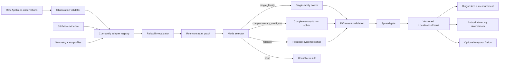
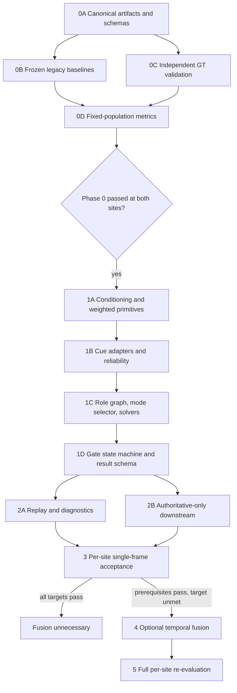

# Haware Localization Accuracy — Technical Design

## Overview

This design introduces a measurement-gated, **reliability-aware multi-cue** Haware localization system while preserving Apollo-24 conventions, the existing handedness correction, post-fit spread rejection, and disabled-mode parity. The estimator evaluates documented cue families according to the role each can reliably provide in the current site/view: orientation, position, or camera-relative bearing. Wheel and validated ground-contact cues remain preferred `h=0` position anchors because their parallax correction is exactly `eta=0`, but no family is globally mandatory or exclusive.

The implementation sequence is **Phase 0 measurement → single-frame multi-cue core → downstream authoritative-coordinate enforcement → optional temporal fusion**. No candidate receives a final acceptance decision until verified frozen baselines, sufficient independent ground truth, and reproducible baseline metrics exist for both `kee-cc` and `taoyuan-tc`. `taipei-cm` remains diagnostic-only.

### Repository Evidence and Design Decisions

- [`haware_localization.py`](../../../trafficlab-project/trafficlab/motion/haware_localization.py) preserves `+x=vehicle left`, `+y=up`, `+z=rear`, wheel indices `(7,8,18,19)`, and wheel height zero. The local `Q[:,0] = -Q[:,0]` handedness correction remains immediately before proper-rotation fitting; the shared template is not mirrored.
- The current all-point fit pools projected points with different height priors. The decision record demonstrates that common eta perturbations leave within-height-family heading invariant, while raw mixed-height fitting can materially rotate heading. The new estimator therefore estimates orientation separately per `Height_Family` and only combines completed orientation estimates.
- The same evidence shows windshield/glass cues may provide excellent camera-relative bearing despite insufficient heading leverage. Cue adapters expose role-specific constraints instead of forcing every family into a full-pose fit.
- `front_up_right` index `0` is a known kee-cc semantic-misplacement anomaly, not a universal Apollo-24 fact. A versioned kee-cc site/view gate can exclude it with a stable reason; other sites/views use their own evidence.
- Mirrors use an estimated height, not ground contact. Their adapter always carries an estimated-height prior and uncertainty and can never classify them as zero-height anchors.
- Current spread rejection is `spread > threshold`; the approved contract is inclusive rejection at `spread >= threshold`. Current downstream consumers infer safety from coordinate presence; the new result makes authoritative versus diagnostic coordinates explicit.
- Historical wheel-count correlation is retained only as `n_wheel_kp` diagnostics. Mode selection never consumes it.

### Configured Rather Than Invented Values

The immutable `Acceptance_Profile` supplies cue membership, height-family membership, role permissions, topology, visibility, baseline/leverage/rank/confidence boundaries, semantic rules, site/view evidence, eta uncertainty models, reliability functions, mode predicates and priority, fallback evidence, fit uniqueness, conditioning thresholds, spread boundary, confidence mapping, ground-truth rules, diagnostic bands, bootstrap settings, temporal settings, and tie rules. Historical values are evidence to evaluate, not defaults to hard-code.

## Architecture

### Logical Data Flow


The `Role constraint graph` is the central abstraction. It contains separately estimated `OrientationConstraint`, `PositionConstraint`, and `BearingConstraint` nodes with family, height family, reliability, uncertainty, and provenance. A valid primary path covers the required pose degrees of freedom either from one family (`single_family`) or from complementary families (`complementary_multi_cue`).

### Deployment Boundaries

1. `trafficlab.motion`: validation, cue adapters, reliability evaluation, mode selection, pure fitters, fusion of role constraints, gate state machine, and result types.
2. `trafficlab.projection`: calibrated transforms, eta-aware point projection, camera-relative bearing, and read-only conditioning calculation.
3. `trafficlab.io`: Canonical JSON, hashing, versioned schema readers/writers, and compatibility mappings.
4. `trafficlab.measurement`: frozen baselines, ground-truth validation, fixed populations, metrics, confidence intervals, acceptance, calibration analysis, and diagnostic aggregation.
5. Replay scripts: inference adapters only; enrichment and scene scripts are strict authoritative-coordinate consumers.
6. `trafficlab.motion.temporal`: optional offline postprocessor isolated from single-frame estimation.

### Phase and Dependency DAG



Phase 0 creates verified artifacts, not documentation placeholders. Pure primitives may be developed behind tests while ground truth is collected, but profile freezing and final candidate evaluation cannot bypass Phase 0. Temporal fusion remains disabled until every single-frame prerequisite passes and at least one Requirement 5 target remains unmet.

### Deterministic Control Flow

```text
validate profile, schemas, calibration, cue registry, and site/view evidence
for detection in stable (site, frame_id, detection_id) order:
    obs = validate_and_deduplicate(raw_keypoints)
    if pose_count < 2: finalize(failed_insufficient_kp, none)
    else:
        candidates = adapters.emit_role_constraints(obs, site, view)
        evaluated = evaluate_eligibility_and_reliability(candidates)
        graph = build_role_constraint_graph(evaluated)
        selection = select_nonoverlapping_mode(graph, profile.priority)
        if no primary path: evaluate fallback predicate exactly once
        if no selected path: finalize(abstained, none)
        elif selected required conditioning is invalid: finalize(abstained, none)
        elif selected required conditioning >= threshold: finalize(near_horizon, none)
        else:
            pose = solve selected path without raw mixed-height orientation pooling
            if fit/numeric invalid: finalize(abstained, none)
            elif spread is nonfinite or spread >= boundary:
                finalize(extrapolated, none, diagnostic_position=pose.position)
            else:
                finalize(ok for primary or fallback for fallback,
                         authoritative_position=pose.position)
emit complete gate trace; all stages after first failure are not_evaluated
```

Fallback is considered only when every primary path is reliability-ineligible. Once a path is selected, conditioning, fit, numeric, or spread rejection is terminal; fallback cannot replace a safety rejection.

## Components and Interfaces

### 1. Acceptance Profile, Canonical Artifacts, and Phase 0

```python
class AcceptanceProfileRepository(Protocol):
    def load(profile_id: str) -> AcceptanceProfile: ...
    def validate(profile: AcceptanceProfile) -> ProfileValidationReport: ...
    def artifact_hash(profile: AcceptanceProfile) -> ArtifactHash: ...

canonical_json_bytes(value) -> bytes
sha256_bytes(data: bytes) -> ArtifactHash
publish_baseline(manifest, artifacts) -> BaselineId
verify_baseline(baseline_id) -> VerifiedBaseline
compare_comparability(baseline, rerun) -> list[CanonicalPathDifference]
```

Profile validation rejects incomplete cue/height-family partitions, undocumented role mappings, non-finite thresholds, missing site/view evidence, missing mirror uncertainty, overlapping modes, nondeterministic priority, invalid boundary semantics, unsupported schemas, or absent per-calibration conditioning thresholds. Canonical encoding is UTF-8 with sorted object keys, compact separators, preserved array order, one LF, and no NaN/infinity. Baseline publication verifies hashes and atomically publishes immutable content-addressed bytes. Comparability checks presence, JSON type, value, and array order for every frozen field.

Ground-truth validation groups duplicate identities before other checks so permutation cannot affect exclusion. It validates lineage, independence, complete metadata, finite coordinates/uncertainty, partition membership, and non-null track IDs. Each site needs at least 30 eligible detections and three independently tracked IDs. The fixed ordered population is frozen before baseline/candidate joins; join failures never shrink the denominator.
### 2. Observation Validator and Cue Adapter Registry

```python
class ObservationValidator(Protocol):
    def normalize(raw, profile) -> NormalizedObservations | TypedValidationFailure: ...

class CueFamilyAdapter(Protocol):
    family: CueFamily
    def propose(obs, context: SiteViewContext) -> Sequence[CandidateConstraint]: ...

class CueAdapterRegistry(Protocol):
    def adapters(profile) -> Mapping[CueFamily, CueFamilyAdapter]: ...
```

Normalization validates identifiers, labels, coordinates, confidence, metadata, and duplicate policy, then sorts by keypoint ID while retaining original order. `n_wheel_kp` is computed afterward from valid visible IDs `7,8,18,19` and is diagnostics-only.

Required explicit adapters are:

| Adapter | Required treatment | Candidate outputs |
|---|---|---|
| `wheel_ground_contact` | wheel/validated contact membership; `h=0`, `eta=0`; same-side longitudinal pairs and other frozen topologies; preferred equal-reliability position support | orientation when leverage/rank passes; zero-height position; bearing if defined |
| `windshield_glass_corner` | short/lateral heading leverage evaluated independently from bearing; semantic checks; site/view evidence | bearing and position/centerline; orientation only when its own leverage/rank passes |
| `roof_corner` | documented roof `Height_Family`, eta interval and uncertainty | per-height-family orientation; position/bearing with parallax uncertainty |
| `mirror` | documented **estimated-height** prior and uncertainty; never ground contact | bearing/position and, only with sufficient leverage, per-height-family orientation |
| `other_documented` | explicit keypoint set, height family, roles, and evidence; undocumented points produce no constraints | only profile-authorized roles |

The registry requires every estimation-eligible keypoint to belong to exactly one cue family and every orientation-eligible keypoint to exactly one height family. A keypoint may participate in multiple role candidates from its one family, but each candidate is evaluated independently.

### 3. Site/View Semantic Evidence

`SiteViewEvidence` is versioned, hashed profile data keyed by `(site, view_region, cue_family, evidence_version)`. It records applicable keypoints, validated/invalid semantics, sample provenance, reason codes, and permitted roles. View-region assignment is deterministic and uses frozen calibrated image-space or bearing-space boundaries.

For `kee-cc`, any candidate using Apollo-24 `front_up_right` index `0` first executes `kee_cc_front_up_right_0_semantic_misplacement`. Failure excludes index `0` from all estimator support with a stable reason while preserving the observation diagnostically. This gate is not copied globally: a site/view without evidence of the anomaly evaluates index `0` using its own applicable evidence. Missing required evidence makes the candidate ineligible rather than assuming correctness.

### 4. Projection Conditioner

For undistorted observation `(u,v)`, homography rows `h0,h1,h2`, `a=h0·[u,v,1]`, `b=h1·[u,v,1]`, and `d=h2·[u,v,1]`:

```text
J = 1/d² * [[h00*d - a*h20, h01*d - a*h21],
            [h10*d - b*h20, h11*d - b*h21]]
conditioning = sigma_max(J) / px_per_m
```

The metric depends only on calibrated projection geometry and the observation coordinate. Invalid undistortion, denominator, Jacobian, singular value, or scale returns `invalid_conditioning_metric`. Every required point is checked before fitting: finite values `< threshold` pass and values `>= threshold` reject. Height correction is excluded from this common geometric safety metric.

### 5. Eligibility and Reliability Evaluation

Each candidate constraint records these checks when applicable: family membership, visibility/topology, template and projected baseline or leverage, centered template/observation rank, per-keypoint confidence, label/semantic consistency, height-family uncertainty, site/view evidence, and conditioning. Minimum boundaries are inclusive. Any failed check makes the constraint reliability-ineligible.

```python
class ReliabilityEvaluator(Protocol):
    def evaluate(candidate, context, profile) \
        -> EligibleConstraint | IneligibleConstraint | TypedValidationFailure: ...
```

The profile-defined deterministic weighting function receives only recorded factors. A normalized conceptual form is:

```text
w_role = role_prior
       * visibility_score
       * leverage_score(role)
       * conditioning_score
       * confidence_score
       * semantic_score
       * eta_certainty_score(height_family)
```

The actual functions and normalization are frozen profile data. They must be nondecreasing in projected baseline/leverage with other factors fixed and nonincreasing in eta uncertainty with other factors fixed. A reliability-eligible zero-height anchor receives the position preference tie-break over an otherwise equal nonzero-height cue. Weights never bypass eligibility or safety gates.
### 6. Role-Specific Constraint Outputs

```python
@dataclass(frozen=True)
class OrientationConstraint:
    cue_family: CueFamily
    height_family: HeightFamily
    heading_unit: Vec2
    angular_variance: float
    eta_interval: tuple[float, float]
    reliability_weight: float
    source_keypoint_ids: tuple[int, ...]

@dataclass(frozen=True)
class PositionConstraint:
    cue_family: CueFamily
    point_or_line: PositionGeometry
    covariance: Mat2
    zero_height_anchor: bool
    reliability_weight: float

@dataclass(frozen=True)
class BearingConstraint:
    cue_family: CueFamily
    camera_origin_sat: Vec2
    bearing_unit: Vec2
    angular_variance: float
    reliability_weight: float
```

A bearing is computed from the camera nadir to the flat-homography point. Height parallax is radial about that origin, so bearing can remain eligible even when uncertain height makes metric position weak. Position constraints may be points, centerlines, or rays and expose covariance rather than pretending to be full-pose correspondences. Orientation constraints expose circular direction and uncertainty and never silently carry position authority.

### 7. Height-Family Orientation Estimation

**Raw point orientation fitting across mixed height families is prohibited.** The orientation pipeline is:

1. Partition eligible orientation candidates by `Height_Family`.
2. Within each family, apply its common height/eta model and estimate one family heading using only that family's points.
3. Validate leverage, rank, ambiguity, residual, and finite output for that family.
4. Convert each successful heading to a unit vector and attach reliability plus eta-induced angular uncertainty.
5. Combine completed family headings only by a frozen circular uncertainty-aware rule, for example:

```text
alpha_f = reliability_f / (angular_variance_f + eta_angular_variance_f + epsilon)
u = sum_f alpha_f * [cos(theta_f), sin(theta_f)]
theta = atan2(u_y, u_x)
```

6. Reject an ambiguous/near-zero resultant according to the frozen uniqueness tolerance.

A family lacking required eta uncertainty may produce a diagnostic family heading but receives zero combination weight. The combiner consumes family estimates, never their raw points. This preserves same-family common-eta heading invariance and prevents unequal height errors from contaminating orientation. The final record retains every family heading, interval, uncertainty contribution, weight, and residual.

### 8. Mode Selector and Complementary Fusion

```python
class ModeSelector(Protocol):
    def select(graph: RoleConstraintGraph, profile: GeometryProfile) \
        -> ModeSelection | TypedValidationFailure: ...

class PoseAssembler(Protocol):
    def solve(selection: ModeSelection) -> PoseEstimate | TypedValidationFailure: ...
```

The selector enumerates profile-authorized paths in deterministic priority order and validates predicates are non-overlapping for every valid input:

- `single_family`: exactly one reliability-eligible family supplies all required pose constraints. It may combine multiple roles from that family, but orientation remains within one height family or follows the family adapter's documented subfamily rule.
- `complementary_multi_cue`: two or more families jointly cover required pose constraints. Typical examples are wheel/ground-contact orientation plus glass bearing, or roof-family orientation plus zero-height wheel position. Position and bearing are solved conditioned on the separately estimated orientation; roles are not collapsed into one indiscriminate point cloud.
- `fallback`: selected only after every primary path is ineligible and the frozen reduced-evidence predicate plus conditioning checks pass.
- `none`: no eligible support or an unusable terminal result.

Zero visible wheels does not force fallback: a reliable non-wheel primary path selects `single_family` or `complementary_multi_cue`. Conversely, visible wheels do not force their use if their role checks fail. `n_wheel_kp` never appears in predicates.

Complementary pose assembly minimizes a versioned weighted objective over role residuals:

```text
minimize over center t and optional heading theta:
    sum position constraints w_p * Mahalanobis(position_residual)
  + sum bearing constraints  w_b * angular_or_cross_track_residual
  + sum completed orientation constraints w_o * angular_residual
```

If orientation has already been fixed by an eligible family estimate, only position/bearing terms solve translation. If multiple completed family orientations are eligible, the eta-uncertainty-aware circular combiner supplies heading before translation. Rank/uniqueness requirements apply to the assembled role graph.

### 9. Weighted Proper-Rigid Primitive

The fixed-scale weighted Procrustes primitive remains available for an eligible **single height family** or other profile-authorized homogeneous support. It validates equal lengths/shapes, finite points, finite nonnegative weights, at least two positive weights, positive finite total, rank, and uniqueness. Zero-weight points are excluded everywhere.

```text
W = sum(w_i)
q_bar = sum(w_i Q_i)/W; p_bar = sum(w_i P_i)/W
H = sum(w_i (Q_i-q_bar)(P_i-p_bar)^T)
R = proper rotation minimizing sum(w_i ||P_i-(R Q_i+t)||²)
t = p_bar - R q_bar
```

The source uses template `(x,z)` scaled to satellite pixels and applies the local x mirror before proper rotation. Returned `R` satisfies orthogonality and `det(R)=+1`. Invalid shape/coordinates/weights, zero or nonfinite total, deficient rank, ambiguity, or nonfinite output returns the approved typed failure and no authoritative coordinate. This primitive must not be used to bypass the per-height-family orientation pipeline.
### 10. Gate State Machine and Result Semantics

| Earliest stage | Condition | Status | Mode | Usable | Coordinate |
|---|---|---|---|---|---|
| observation | fewer than two valid pose observations | `failed_insufficient_kp` | `none` | false | authoritative null |
| observation | typed validation failure with sufficient count | `abstained` | `none` | false | authoritative null |
| cue eligibility | no primary and fallback fails | `abstained` | `none` | false | authoritative null |
| conditioning | selected required metric invalid | `abstained` | `none` | false | authoritative null |
| conditioning | selected required metric `>=` threshold | `near_horizon` | `none` | false | authoritative null |
| fit/numeric | selected solver fails | `abstained` | `none` | false | authoritative null |
| spread | nonfinite or `>=` boundary | `extrapolated` | `none` | false | fit position diagnostic-only |
| completion | primary succeeds | `ok` | selected primary mode | true | finite authoritative |
| completion | fallback succeeds | `fallback` | `fallback` | true | finite authoritative |

Every gate is `pass | fail | not_evaluated`; the first failure fixes status/reason and all later gates are `not_evaluated`. An unusable result always has mode `none`. Confidence is a versioned function of selected roles, cue reliability, conditioning, residuals, orientation disagreement, and uncertainty; it cannot alter status or precedence.

### 11. Versioned Result and Compatibility

```python
class LocalizationResultV2(TypedDict):
    schema_version: str
    status: Literal['ok','fallback','extrapolated','near_horizon','abstained','failed_insufficient_kp']
    usable: bool
    estimator_mode: Literal['single_family','complementary_multi_cue','fallback','none']
    sat_coords: Vec2 | None
    authoritative_position_sat_px: Vec2 | None
    diagnostic_position_sat_px: Vec2 | None
    diagnostic_only: bool
    heading: float | None
    confidence: float
    n_keypoints: int
    n_wheel_kp: int
    p_sat: list[Vec2 | None]
    spread_m: float | None
    selected_constraints: list[SelectedConstraintRecord]
    family_orientation_estimates: list[FamilyOrientationRecord]
    selection_reason_code: str
    failure_reason_code: str | None
    decisive_gate: str
    gate_trace: GateTrace
    cue_diagnostics: list[CueDiagnostic]
```

For usable records, `sat_coords == authoritative_position_sat_px`; for unusable records both are null. Unsafe fitted coordinates appear only in the diagnostic field. Selected constraints expose family, height family, role, keypoints, reliability factors/weight, uncertainty, and zero-height status. Family orientation records make separate estimation and cross-family combination auditable.

Absent/false multi-cue configuration dispatches to the frozen legacy implementation and schema. A documented version enables V2. Invalid versions/types fail before payload processing with `invalid_multi_cue_configuration`. Disabled mode reproduces baseline finite coordinates and headings within `1e-9`, statuses/nulls exactly, and omits multi-cue-only fields. Enabled mode preserves legacy field meanings and Apollo-24 indices, dimensions, and axes.

### 12. Replayable Diagnostics

The recorder emits one ordered record for every attempt, including rejection. It contains raw/original and normalized observations; visible family memberships; every proposed role; every eligibility value, threshold, and outcome; site/view evidence and reason; all reliability factors/weights; per-height-family orientations and eta uncertainties; selected role graph; conditioning; fallback evidence; fit details; spread; gate trace; coordinate roles; and complete baseline/profile/template/calibration/run/source provenance.

Reports aggregate by site, status, mode, conditioning band, cue family, height family, role, and reliability class using frozen denominator predicates and zero-denominator rules. Replaying hash-verified stored observations reproduces decisions, weights, gates, result fields, Canonical JSON report hash, and human summary without rerunning inference. Threshold changes are new immutable profile artifacts with old/new/reason/run audit entries.

### 13. Measurement and Acceptance Reporting

For each acceptance site independently, the harness joins exactly one GT, baseline, and candidate result to every fixed-population identity. Usable errors use unrounded authoritative coordinates. It reports overall count/median/nearest-rank p90/max, coverage, status rates, mode rates, and separate count/error/coverage contribution for `single_family`, `complementary_multi_cue`, and `fallback`; contributions must sum to total coverage within `1e-12`.

Selective risk retains finite-confidence usable records sorted by `(-confidence, frame_id, detection_id)`, requests 5-point increments from 20%, and uses `k=ceil(cN)`. Paired intervals resample the same track-ID sequence/multiplicity for baseline and candidate. Acceptance requires at each site: nonempty samples, median `<=0.95×` baseline, p90 no worse, coverage at least baseline minus `0.02`, and risk no worse at every matched point including 20%. A pooled result, proxy metric, or `taipei-cm` record cannot rescue failure.

Acceptance output includes Phase-0 state and preliminary/final status; per-site overall and per-mode metrics/intervals; status/mode/cue-family/role distributions; primary/fallback/none reasons; index-0 gate exclusions by view; mirror uncertainty outcomes; per-height-family orientation usage/disagreement; zero-height anchor selection; conditioning/spread failures; selective-risk curves; and threshold/profile hashes. While Phase 0 is incomplete, reports are labeled `preliminary` and omit final pass/acceptance decisions.
### 14. Downstream Authoritative-Coordinate Safety

Enrichment normalizes through compatibility, then derives `position_m` only for `ok`/`fallback`, `usable=true`, finite authoritative coordinates. Unusable observations close the track segment and produce null position/velocity. Velocity is computed only between consecutive usable observations with equal non-null track IDs, strictly increasing timestamps, no intervening unusable/missing result, and frame gap within the profile limit.

Scene scanning includes only usable finite authoritative positions. Diagnostic coordinates never affect extents, interpolation, collision geometry, or collider eligibility. Accepted/excluded counts are reported by status and mode. A requested track with no usable observations fails with `no_usable_collider_observations`, track ID, and status counts.

### 15. Calibration Identifiability

For calibrated camera point `C`, apparent flat-homography point `A`, and independently established real-plane target `R`:

```text
eta_sample = 1 - dot(R-C, A-C) / dot(A-C, A-C)
eta = h / z_cam
```

Analysis is separate by site and documented height family and records height prior/uncertainty, eta/interval, configured camera height, and provenance. It never pools authoritative eta across sites or height families. Image evidence identifies eta, not `h` and `z_cam` separately; the `h=0, eta=0` family cannot identify camera height. `Jointly_Identified_Z_Cam=h/eta` is authoritative only from independent positive `h`, positive eta with interval lower bound above zero, and a finite positive quotient. Direct camera height is authoritative only from independent metrology. Field names distinguish configured, direct, jointly identified, and effective-eta quantities. Multi-cue position acceptance is independent of camera-height claims.

### 16. Optional Temporal Fusion

Fusion is disabled by default and operates only on uninterrupted equal-track segments after every single-frame prerequisite passes and at least one improvement target remains unmet. Source records remain immutable; unusable records retain status, `usable=false`, and null authoritative position and terminate segments. Any changed usable position is stored separately with complete provenance. A fusion candidate has a distinct ID and is reevaluated at both sites against all Requirement 5 gates; any site coverage decrease or p90 increase versus its identified unfused source rejects it.

## Data Models

### Core Types

```text
CueFamily = wheel_ground_contact | windshield_glass_corner | roof_corner | mirror | other_documented
ConstraintRole = orientation | position | bearing
EstimatorMode = single_family | complementary_multi_cue | fallback | none
HeightFamily = profile-defined identifier + height prior + EffectiveEtaInterval/uncertainty
SiteViewContext = {site, view_region, evidence_version, calibration_id}
CandidateConstraint = {family, height_family?, role, keypoint_ids, geometry, required_checks}
CueReliabilityFactors = {visibility, leverage, conditioning, confidence, semantic, eta_uncertainty, site_view}
EligibleConstraint = CandidateConstraint + {checks, factors, weight, zero_height_anchor}
RoleConstraintGraph = ordered eligible constraints + pose-coverage/uniqueness analysis
ModeSelection = {mode, selected_constraint_ids, reason_code, conditioning_set}
FamilyOrientationRecord = {height_family, heading?, uncertainty, reliability, combination_weight, diagnostic_only, sources}
PoseEstimate = {position, heading, covariance, residuals_by_role, selected_constraints}
TypedValidationFailure = {code, detection_id?, field_path?, gate?, details, authoritative_position=null}
```

### Profile Model

`AcceptanceProfile` contains version/hash and nested `observation_validity`, `cue_families`, `height_families`, `site_view_evidence`, `role_geometry`, `reliability_weights`, `mode_selection`, `fallback`, `conditioning`, `spread`, `confidence`, `ground_truth`, `metrics`, `bootstrap`, `diagnostics`, `schema_compatibility`, `calibration_analysis`, `temporal`, and `tie_rules`. Profile validation proves complete family assignment, complete role definitions, required uncertainty availability, mode exclusivity, deterministic priority, and finite valid thresholds before evaluation.

### Baseline, Evaluation, Diagnostics, and Fusion

`BaselineManifest` contains all glossary fields and ordered inventories. `GroundTruthRecord` contains identity, metre coordinate/reference point, tracking/timestamps, annotation lineage/independence, and uncertainty. `SiteMetricReport` holds fixed `N`, separate samples, overall/per-mode metrics, risk, paired intervals, distributions, gate outcomes, and preliminary/final state. `DetectionDiagnosticRecord` is append-only and includes the complete cue/role/orientation/gate provenance. `FusionRecord` contains untouched source, optional separate fused coordinate, provenance, and reason.

### Schema Invariants

1. `usable == (status in {'ok','fallback'})`.
2. Usable primary results have mode `single_family` or `complementary_multi_cue`; usable fallback results have mode `fallback`.
3. Unusable implies mode `none`, null `sat_coords`, and null authoritative position.
4. Diagnostic coordinates are never aliases of authoritative fields.
5. Every selected orientation source belongs to exactly one height family; cross-family combination references completed family estimates only.
6. Mirror constraints have nonzero/estimated-height metadata and cannot be zero-height anchors.
7. Every result has one decisive gate/reason and later `not_evaluated` markers.
8. Serialization preserves closed enums, nulls, types, finite values, and array order.
## Correctness Properties

*A property is a characteristic or behavior that should hold true across all valid executions of a system-essentially, a formal statement about what the system should do. Properties serve as the bridge between human-readable specifications and machine-verifiable correctness guarantees.*

### Property 1: Handed geometric recovery and equivariance

For all nondegenerate noise-free eligible supports, finite translations, and rotations, the unchanged template plus local x handedness correction recovers the generated pose; translating observations translates only position, and jointly rotating source/observations rotates position and heading consistently.

**Validates: Requirements 1.1, 1.2, 7.15, 7.16, 7.17, 7.18, 15.6, 15.7, 15.8, 15.9, 15.10, 15.11, 15.12**

### Property 2: Weighted-fit algebra

For all valid nondegenerate finite weighted point sets, positive-weight centroids/covariance and `t=p_bar-Rq_bar` are used, the returned rotation is proper and orthogonal, and the weighted fixed-scale objective is minimal among proper rotations.

**Validates: Requirements 7.1, 7.2, 7.3, 7.4, 7.5, 7.6, 7.7, 7.8, 7.9, 7.10, 7.11, 7.12, 7.13, 7.14, 7.15, 7.16, 7.17, 7.18, 15.17**

### Property 3: Weight representation invariance

For all valid weighted fits, finite positive uniform weight scaling and addition of finite zero-weight correspondences preserve rank semantics, objective representation, position, and heading within specified tolerances.

**Validates: Requirements 7.7, 7.8, 7.9, 7.10, 7.11, 7.19, 7.20, 7.21, 7.22, 15.16, 15.18, 15.59**

### Property 4: Typed estimator failures are authoritative-safe

For all malformed, nonfinite, invalid-weight, zero/nonfinite-total, rank-deficient, ambiguous, or nonfinite-output fits, the estimator returns the specified typed failure and no Authoritative Position.

**Validates: Requirements 7.23, 7.24, 7.25, 7.26, 7.27, 7.28, 7.29, 7.30, 7.31, 7.32, 7.33, 7.34, 15.23, 15.30, 15.31, 15.32, 15.33, 15.59**

### Property 5: Cue-family partition and profile determinism

For all valid profiles and estimation-eligible keypoints, each point belongs to exactly one cue family, each orientation point to exactly one height family, all roles/evidence/uncertainties are defined, and mode predicates are non-overlapping; every invalid profile fails before detection evaluation.

**Validates: Requirements 6.7, 6.8, 6.9, 6.10, 6.11, 6.12, 6.13, 6.14, 6.15, 6.16, 6.17, 6.18, 6.19, 6.20, 6.21, 6.60**

### Property 6: Cue eligibility, boundary, and replay invariance

For all candidate constraints and equivalent input permutations, eligibility is true exactly when every applicable check passes; exact minimum boundaries pass, below-minimum values fail, and checks, selected families/roles, weights, modes, and reasons are permutation-invariant.

**Validates: Requirements 6.1, 6.2, 6.3, 6.4, 6.5, 6.6, 6.22, 6.23, 6.24, 6.25, 6.26, 6.27, 6.28, 6.29, 6.30, 6.31, 6.32, 6.33, 6.61, 6.62, 6.63, 6.64, 6.65, 6.66, 6.67, 6.68, 15.13, 15.14, 15.15, 15.21, 15.22, 15.48, 15.49, 15.63**

### Property 7: Reliability weighting monotonicity

For all pairs of otherwise equal eligible constraints, greater projected baseline/leverage never lowers weight and greater Height-Family uncertainty never raises weight.

**Validates: Requirements 6.21, 6.33, 6.34, 6.35, 15.73, 15.74**

### Property 8: Zero-height anchor preference and mirror uncertainty

For all otherwise equal position candidates, an eligible documented `h=0` ground-contact cue is preferred and projected with `eta=0`; every mirror cue uses its estimated-height uncertainty model and is never a zero-height anchor.

**Validates: Requirements 6.36, 6.37, 6.38, 6.39, 6.40, 15.65, 15.72**

### Property 9: Glass bearing survives weak heading leverage

For all windshield/glass-corner candidates with reliable bearing evidence but heading leverage below the frozen boundary, the Position-Bearing Constraint remains eligible while the Orientation Constraint is ineligible.

**Validates: Requirements 6.41, 6.42, 6.43, 15.64**

### Property 10: Site/view anomaly gates do not leak globally

For all kee-cc detections where index `0` fails the semantic-misplacement gate, index `0` is excluded with the stable reason; for all other site/views, index `0` is evaluated only under their applicable evidence.

**Validates: Requirements 6.44, 6.45, 6.46, 15.66, 15.67**

### Property 11: Height-family orientation isolation

For all orientation evidence, a common finite eta perturbation within one Height Family preserves that family's heading, while multiple families are fit separately and unequal eta errors never cause raw cross-family point pooling.

**Validates: Requirements 6.47, 6.48, 15.68, 15.69, 15.70**

### Property 12: Eta-uncertainty-aware orientation combination

For all sets of completed family orientation estimates, cross-family heading uses recorded reliability and eta uncertainty; increasing one family's eta uncertainty cannot increase its combination influence, and a family missing required uncertainty is diagnostic-only.

**Validates: Requirements 6.49, 6.50**

### Property 13: Role-complete mode selection

For all reliability-eligible role graphs, one family covering the required pose selects `single_family`, complementary roles from two or more families select `complementary_multi_cue`, and wheel visibility/count cannot override role coverage.

**Validates: Requirements 1.7, 1.8, 6.51, 6.52, 6.53, 6.54, 6.69, 6.70, 15.19, 15.71**

### Property 14: Fallback is primary-ineligibility-only

For all sufficient detections, fallback is evaluated only when every primary path is ineligible, selected exactly when its frozen predicate and conditioning pass, and otherwise yields `none`; no later fallback replaces a selected-path safety failure.

**Validates: Requirements 6.55, 6.56, 6.57, 6.58, 6.59, 8.6, 8.7, 8.8, 8.9, 8.10, 8.11, 8.12, 8.13, 8.14, 8.15, 8.16, 8.17, 8.18, 9.8, 9.9, 9.10, 15.20, 15.53, 15.54**

### Property 15: Conditioning rejection is inclusive and pre-fit

For all required observations/calibrations, finite conditioning below threshold passes, exact threshold or above rejects before fit, and nonfinite conditioning returns `invalid_conditioning_metric`; spread remains not evaluated on conditioning failure.

**Validates: Requirements 6.26, 6.58, 6.59, 8.8, 8.9, 8.10, 8.11, 9.1, 9.2, 9.3, 9.4, 9.5, 9.6, 9.7, 9.8, 9.9, 9.10, 9.11, 9.12, 9.13, 9.14, 9.15, 9.16, 9.17, 9.18, 9.19, 9.20, 15.45, 15.46, 15.47**

### Property 16: First-failure gate precedence

For all combinations of observation, eligibility, conditioning, fit, numeric, and spread failures, the earliest failure uniquely determines status/reason/mode and every later stage is `not_evaluated`.

**Validates: Requirements 8.1, 8.2, 8.3, 8.4, 8.5, 8.6, 8.7, 8.8, 8.9, 8.10, 8.11, 8.12, 8.13, 8.14, 8.15, 8.16, 8.30, 8.31, 8.32, 15.54**

### Property 17: Spread rejection is inclusive and post-fit

For all fitted detections, finite spread below the boundary continues, while exact-boundary, above-boundary, or profile-mapped nonfinite spread yields no Authoritative Position; any retained fit position is diagnostic-only.

**Validates: Requirements 1.3, 1.4, 1.5, 1.6, 8.14, 8.15, 8.16, 9.12, 9.13, 9.14, 15.42, 15.43, 15.44**

### Property 18: Result state and coordinate coherence

For all results, usable is true exactly for `ok` or `fallback`; usable primary modes are `single_family`/`complementary_multi_cue`, fallback mode matches fallback status, and every unusable result has mode `none`, null authoritative aliases, and diagnostic-only retained coordinates.

**Validates: Requirements 8.17, 8.18, 8.19, 8.20, 8.21, 8.22, 8.23, 8.24, 8.25, 8.26, 8.27, 8.28, 8.29, 8.30, 8.31, 8.32, 13.16, 13.17, 13.18, 15.24, 15.26, 15.28, 15.41**

### Property 19: Authoritative-only downstream propagation

For all result streams, enrichment, scene, collider, and enabled fusion consume spatial data only from usable Authoritative Positions; diagnostic/unusable coordinates produce no downstream spatial contribution.

**Validates: Requirements 8.32, 10.1, 10.2, 10.3, 10.19, 10.20, 10.21, 10.22, 10.23, 10.24, 10.25, 10.26, 11.11, 11.12, 11.13, 15.24, 15.25, 15.27, 15.41**

### Property 20: Track interruptions prevent bridging

For all ordered streams, velocity equals position delta over positive time only for consecutive usable observations in one uninterrupted non-null track; every defined interruption makes the next usable velocity null.

**Validates: Requirements 10.4, 10.5, 10.6, 10.7, 10.8, 10.9, 10.10, 10.11, 10.12, 10.13, 15.60**

### Property 21: Versioned schema round trip and disabled parity

For all valid supported records, round trip preserves names, types, finite values, enums, nulls, order, and meaning; for all frozen-baseline records, absent/false multi-cue configuration reproduces legacy outputs and omits multi-cue-only fields within approved tolerances.

**Validates: Requirements 1.14, 1.15, 1.16, 1.17, 13.1, 13.2, 13.3, 13.4, 13.5, 13.6, 13.7, 13.8, 13.9, 13.10, 13.11, 13.12, 13.13, 13.14, 13.15, 13.16, 13.17, 13.18, 13.19, 13.20, 13.21, 13.22, 13.23, 13.24, 13.25, 13.26, 13.27, 13.28, 13.29, 13.30, 13.31, 13.32, 13.33, 13.34, 13.35, 13.36, 15.28, 15.29, 15.34, 15.35**

### Property 22: Canonical baseline identity and Phase-0 finality

For all finite manifests/artifacts and all two-site prerequisite states, identity/comparability are deterministic and Phase 0 passes exactly when every prerequisite passes at both sites; otherwise results remain preliminary with no final decision.

**Validates: Requirements 2.1, 2.2, 2.3, 2.4, 2.5, 2.6, 2.13, 2.14, 2.17, 2.18, 2.19, 2.20, 2.21, 2.26, 2.27, 2.28, 2.29, 2.30, 2.31, 2.32, 2.33, 2.34, 2.35, 15.55, 15.56**

### Property 23: Ground-truth exclusion is deterministic

For all generated ground-truth collections, validity rules produce the frozen inclusion/exclusion/audit result; duplicate-group permutation preserves exclusion and sufficiency boundaries are enforced per site.

**Validates: Requirements 3.1, 3.2, 3.3, 3.4, 3.5, 3.6, 3.7, 3.8, 3.9, 3.10, 3.11, 3.12, 3.13, 3.14, 3.15, 3.16, 3.17, 3.18, 3.19, 3.20, 3.21, 3.22, 3.23, 3.24, 3.25, 3.26, 3.27, 3.28, 3.29, 3.30, 3.31, 3.32, 3.33, 3.34, 3.35, 3.36, 3.37, 15.50, 15.57, 15.58**

### Property 24: Fixed-population mode accounting

For all fixed populations and differing usable subsets, systems keep separate Error Samples over identical denominators, fallback participates in overall metrics, and `single_family`, `complementary_multi_cue`, and `fallback` contributions sum to coverage within `1e-12`.

**Validates: Requirements 5.1, 5.2, 5.3, 5.4, 5.5, 5.6, 5.7, 5.8, 5.9, 5.10, 5.11, 5.12, 5.13, 5.14, 5.15, 5.16, 5.17, 5.18, 5.19, 5.20, 5.21, 5.22, 5.23, 5.24, 5.25, 5.26, 5.27, 5.28, 5.29, 5.30, 5.31, 5.32, 5.33, 5.34, 15.50, 15.51, 15.52, 15.53**

### Property 25: Selective-risk and paired-resampling determinism

For all generated populations, finite-confidence sorting, `ceil(cN)` retention, null schedules, and required points are exact; every bootstrap replicate applies the same sampled track sequence/multiplicity to baseline and candidate.

**Validates: Requirements 5.32, 5.33, 5.34, 5.35, 5.36, 5.37, 5.38, 5.39, 5.40, 5.41, 5.42, 5.43, 5.44, 5.45, 5.46, 5.47, 5.48, 5.49, 5.50, 5.51, 5.52, 5.53, 5.54, 5.55, 5.56**

### Property 26: Acceptance is site-separate and proxy-proof

For all generated site reports, a candidate passes only when every accuracy/coverage/risk gate passes independently at both acceptance sites; pooled, proxy, or diagnostic-site data cannot change a failure or any acceptance calculation.

**Validates: Requirements 4.1, 4.2, 4.3, 4.4, 4.5, 4.6, 4.7, 4.8, 4.9, 4.10, 4.11, 4.12, 4.13, 4.14, 4.15, 4.16, 4.17, 4.18, 5.57, 5.58, 5.59, 5.60, 5.61, 5.62, 5.63, 5.64, 5.65, 15.37, 15.38, 15.39, 15.40**

### Property 27: Diagnostics are complete and replay-deterministic

For all hash-matching replay artifacts, every attempt records complete cue/family/role/reliability/orientation/gate provenance and replay reproduces decisions, results, aggregates, report hash, and summary exactly.

**Validates: Requirements 6.65, 6.66, 6.67, 6.68, 12.1, 12.2, 12.3, 12.4, 12.5, 12.6, 12.7, 12.8, 12.9, 12.10, 12.11, 12.12, 12.13, 12.14, 12.15, 12.16, 12.17, 12.18, 12.19, 12.20, 12.21, 12.22, 12.23, 12.24, 12.25, 12.26, 12.27, 12.28, 12.29, 12.30, 12.31, 12.32, 12.33, 12.34, 12.35, 12.36, 12.37, 12.38, 12.39, 12.40, 12.41**

### Property 28: Fusion preserves source safety and cannot regress

For all permitted fusion candidates, segmentation never crosses interruptions, source records remain unchanged, unusable frames stay null, changed positions have complete provenance, and any per-site coverage decrease or p90 increase rejects the candidate.

**Validates: Requirements 11.1, 11.2, 11.3, 11.4, 11.5, 11.6, 11.7, 11.8, 11.9, 11.10, 11.11, 11.12, 11.13, 11.14, 11.15, 11.16, 11.17, 11.18, 11.19, 11.20, 11.21, 11.22, 11.23, 11.24, 11.25, 11.26**

### Property 29: Calibration identifiability is explicit

For all finite site/family calibration samples, eta remains site/family-specific; image-only evidence never separates height and camera height; zero-inclusive intervals omit joint camera height, and only valid independent positive measurements produce authoritative derived quantities.

**Validates: Requirements 14.1, 14.2, 14.3, 14.4, 14.5, 14.6, 14.7, 14.8, 14.9, 14.10, 14.11, 14.12, 14.13, 14.14, 14.15, 14.16, 14.17, 14.18, 14.19, 14.20, 14.21, 14.22, 14.23, 14.24, 14.25, 14.26, 14.27, 14.28, 14.29, 14.30, 15.36, 15.61, 15.62**

### Property 30: Property-runner reproducibility

For all design properties, each required seed executes at least 100 cases within the PBT Profile, and every recorded minimized failure replays identically without generating new cases.

**Validates: Requirements 15.1, 15.2, 15.3, 15.4, 15.5**
## Error Handling

Domain functions return `TypedValidationFailure`; command boundaries emit nonzero exits and Canonical JSON errors. No broad exception may substitute coordinates. Every failure has a stable code, field/gate when applicable, detection identity when available, and no Authoritative Position.

| Layer | Representative handling |
|---|---|
| baseline/GT | `baseline_id_mismatch`, `artifact_hash_mismatch`, `frozen_baseline_immutable`, independence/metadata/coordinate/duplicate/uncertainty codes; abort or audited exclusion |
| profile/schema | incomplete family/height/role map, missing site/view evidence, missing mirror uncertainty, overlapping modes, `invalid_multi_cue_configuration`, `unsupported_schema_version`, field-path errors; fail before records |
| observation/cue | duplicate conflict, `non_finite_coordinate`, semantic/site-view exclusion reason; exclude candidate or emit unusable result |
| conditioning | `invalid_conditioning_metric` or `near_horizon`; selected path is terminal and cannot fall back |
| orientation | deficient leverage/rank, missing eta uncertainty, ambiguous resultant; family may be diagnostic-only or selected solve fails according to profile |
| fit | `invalid_shape`, `invalid_weight`, `zero_total_weight`, `degenerate_geometry`, `numeric_failure`; no authoritative output |
| spread/downstream | `extrapolated` with diagnostic-only position; `legacy_status_policy_required`; `no_usable_collider_observations` |
| diagnostics/fusion | missing provenance, field-path validation, or `diagnostic_replay_artifact_mismatch`; reject derived artifact while preserving source |
| calibration | invalid interval/nonfinite estimate/missing ID; omit unsupported authoritative quantity rather than infer it |

Numeric inputs are validated before NumPy/OpenCV; JSON rejects NaN/infinity. Acceptance execution cannot use projection fallback defaults. SVD failure, overflow, near-zero circular resultant, noninvertible covariance, or role-graph rank deficiency is typed failure, not warning. Partial baseline/report writes remain unpublished.

## Testing Strategy

Property-based testing is applicable because geometry, role selection, weighting, state transitions, serialization, metric transforms, resampling, and calibration algebra are deterministic over large input spaces. It does not attempt to prove external detector quality, annotation UX, filesystem permissions, or storage service behavior.

### Property Tests

Use **Hypothesis**. Each numbered property has exactly one test with a tag such as:

```python
# Feature: haware-localization-accuracy, Property 11: Height-family orientation isolation
```

Each runs at least 100 generated cases for each seed `104729`, `130363`, `155921`, and `196613`. Generators follow the PBT Profile and add cue-family/role graphs, site/view contexts, eta intervals/uncertainties, zero-wheel primary paths, mirror candidates, and kee-cc index-0 cases. Boundary generators use exact values and `math.nextafter` neighbors. Multi-height generators explicitly compare the implementation with a reference pipeline that fits each family separately; tests fail if raw points from different families reach one orientation fit.

### Example and Unit Tests

- north/east/arbitrary handedness examples and exact weighted-fit failure codes;
- adapter contract fixtures for all five required families and all three roles;
- kee-cc index-0 reject/accept-by-view fixtures and non-kee isolation;
- mirror estimated-height and missing-uncertainty examples;
- glass cue with eligible bearing but ineligible heading;
- complementary examples: wheel orientation + glass bearing, roof orientation + wheel position, and non-wheel-only primary support;
- exact status/mode/result combinations and legacy-policy cases;
- hand-computed nearest-rank, selective-risk, paired-track, and per-mode contribution reports;
- calibration zero/positive interval cases and frozen-baseline compatibility goldens.

### Integration and Smoke Tests

- publish/verify/rerun/tamper immutable baselines in a temporary store;
- end-to-end stored-keypoint replay through adapters, V2, diagnostics replay, enrichment, and scene scan without PifPaf;
- profile smoke validation for complete family/height/role partitions, site/view evidence, mirror uncertainty, mode exclusivity, and calibration thresholds;
- annotation-view smoke test for contamination exclusion and mandatory lineage;
- independent `kee-cc`/`taoyuan-tc` acceptance fixture proving `taipei-cm` invariance;
- optional fusion integration only under a prerequisite state that permits it.

### Acceptance Execution

1. Freeze profile, schemas, partitions, independent GT, and baseline artifacts.
2. Verify Phase 0 separately at both acceptance sites.
3. Evaluate the unfused single-frame multi-cue candidate over each fixed population.
4. Publish per-site overall/per-mode error, coverage, risk, intervals, cue/role reliability diagnostics, anomaly gates, and height-family orientation diagnostics.
5. Reject if either site fails; pooled output is informational.
6. If all targets pass, record fusion unnecessary; otherwise, only if every prerequisite passes, evaluate a distinct fusion candidate against all gates and source-regression checks.
## Implementation Sequence

1. **Phase 0A — artifacts/contracts:** Canonical JSON/hash, profile/schema models, typed errors, diagnostics schema.
2. **Phase 0B — baseline:** frozen legacy baselines, disabled-mode goldens, comparability and reproduction.
3. **Phase 0C — independent GT:** annotation isolation, lineage validation, frozen populations for both sites.
4. **Phase 0D — measurement:** deterministic overall/per-mode metrics, selective risk, paired-track intervals, Phase-0 decision/reporting.
5. **Core A — safe primitives:** projection conditioning, weighted proper-rigid fitter, circular orientation/uncertainty primitives, preserving handedness and template conventions.
6. **Core B — cue contracts:** adapter registry for wheel/ground contact, glass, roof, mirror, and other documented families; role outputs and profile validation.
7. **Core C — reliability:** all eligibility checks, monotone weighting, zero-height preference, mirror uncertainty, site/view evidence, kee-cc index-0 gate.
8. **Core D — orientation:** per-Height-Family estimators and eta-uncertainty-aware family-level combiner; enforce no raw mixed-height pooling.
9. **Core E — pose assembly:** role constraint graph, `single_family`, `complementary_multi_cue`, fallback/none selection, complementary position/bearing fusion.
10. **Core F — safety/result:** gate state machine, inclusive conditioning/spread boundaries, V2 schema, compatibility dispatch.
11. **Observability:** replay adapter, full cue/family/role diagnostics, deterministic aggregation/replay, acceptance reporting.
12. **Downstream:** authoritative-only enrichment, segment interruption, scene/collider exclusion.
13. **Evaluation:** single-frame candidate independently at `kee-cc` and `taoyuan-tc`; audit any proposed profile change.
14. **Calibration analysis:** site/family eta reporting in parallel; never substitute for position acceptance.
15. **Optional temporal fusion:** only after the explicit permission condition, followed by full per-site reevaluation.

## Requirements Traceability

| Requirement | Primary design coverage | Verification |
|---|---|---|
| 1 Preserve corrections/scope | repository decisions, handed primitive, spread, diagnostic wheel count, compatibility | Properties 1, 13, 17, 21 |
| 2 Frozen baseline | Phase 0, canonical artifacts, immutable store, finality | Property 22 |
| 3 Independent ground truth | validator, annotation isolation, fixed population sufficiency | Property 23 |
| 4 Evidence/sites | hierarchy, per-site reporting, diagnostic isolation | Property 26 |
| 5 Accuracy/coverage/risk | fixed populations, three-mode reporting, selective risk, intervals | Properties 24-26 |
| 6 Reliable multi-cue selection | adapters, role outputs, reliability, site/view gates, height-family isolation, modes | Properties 5-15 |
| 7 Weighted estimation | proper-rigid primitive and typed validation | Properties 1-4 |
| 8 Modes/status/coordinates | mode selector, gate table, V2 invariants | Properties 14, 16-19 |
| 9 Near horizon | projection Jacobian metric and inclusive pre-fit gate | Property 15 |
| 10 Downstream safety | authoritative-only enrichment/scene and interruptions | Properties 19-20 |
| 11 Temporal fusion | conditional permission, immutable source, provenance, reevaluation | Property 28 |
| 12 Diagnostics | complete cue/family/role records, aggregates, replay | Property 27 |
| 13 Compatibility | opt-in dispatch, schemas, frozen parity | Property 21 |
| 14 Calibration | site/family eta and identifiability limits | Property 29 |
| 15 Executable properties | Hypothesis profile, revised cue/height-family generators, replay | Properties 1-30 |

## Remaining Pre-Implementation Inputs

Final candidate evaluation remains intentionally blocked until immutable profile/Phase-0 artifacts provide: exact cue and height-family maps; role-specific leverage/rank/confidence/semantic rules; site/view region definitions and evidence (including kee-cc index `0`); mirror and all nonzero-height eta uncertainty models; reliability and family-orientation combination functions; non-overlapping mode/fallback predicates; conditioning/spread/confidence values; complete GT/partition/bootstrap/report schemas; sufficient independent data; and verified baselines at both sites. These are frozen acceptance inputs, not values to infer from `taipei-cm` or silently hard-code.
