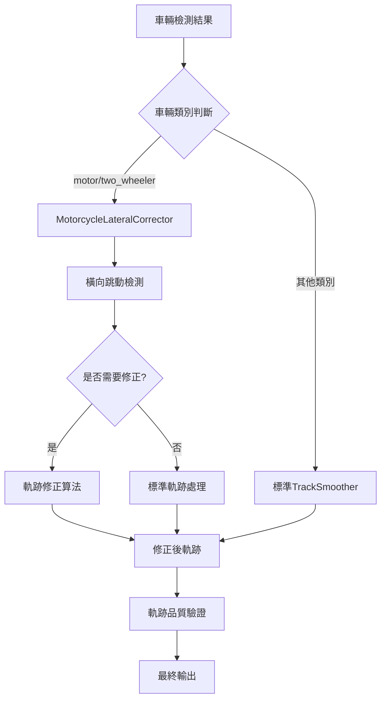
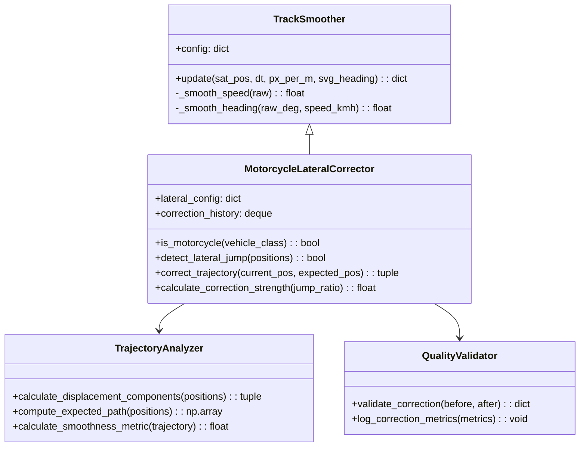

# 機車橫向軌跡修正功能設計文檔

## 概述

機車橫向軌跡修正功能是對TrafficLab系統中TrackSmoother類的增強，專門針對機車（motor/two_wheeler類別）在垂直行駛時出現的橫向跳動問題。該功能通過檢測相對於行進方向的橫向位移異常，並使用平滑算法將軌跡修正回預期的直線路徑，確保軌跡的準確性和平滑性。

### 核心目標

1. **精確檢測**: 識別機車橫向跳動異常（橫向位移遠大於縱向位移）
2. **智能修正**: 使用加權平滑算法將跳動軌跡修正為直線路徑
3. **類別專用**: 僅對motor/two_wheeler類別車輛啟用，不影響其他車輛
4. **可配置性**: 提供豐富的配置參數支持不同場景調優
5. **性能保證**: 保持系統性能和向後兼容性

## 架構

### 系統架構圖



### 類別關係圖



## 組件和接口

### 1. MotorcycleLateralCorrector 類別

擴展TrackSmoother類，添加機車專用的橫向軌跡修正功能。

```python
class MotorcycleLateralCorrector(TrackSmoother):
    def __init__(self, config: dict, vehicle_class: str = None):
        super().__init__(config)
        self.vehicle_class = vehicle_class
        self.lateral_config = config.get('lateral_correction', {})
        
        # 橫向修正參數
        self.lateral_threshold = self.lateral_config.get('threshold', 2.0)
        self.correction_strength = self.lateral_config.get('strength', 0.3)
        self.smoothing_window = self.lateral_config.get('window_size', 5)
        self.max_correction_distance = self.lateral_config.get('max_distance', 2.0)
        
        # 修正歷史記錄
        self.correction_history = deque(maxlen=self.smoothing_window)
        self.consecutive_corrections = 0
        
        # 軌跡分析器
        self.trajectory_analyzer = TrajectoryAnalyzer()
        self.quality_validator = QualityValidator()
```

### 2. 核心接口方法

#### update() 方法增強

```python
def update(self, current_sat_pos: list, dt: float, px_per_m: float, 
          svg_heading: float = None, vehicle_class: str = None) -> dict:
    """
    增強的軌跡更新方法，支持機車橫向修正
    
    Args:
        current_sat_pos: 當前衛星座標位置
        dt: 時間間隔
        px_per_m: 像素到米的轉換比例
        svg_heading: SVG方向角度
        vehicle_class: 車輛類別
        
    Returns:
        包含修正後軌跡信息的字典
    """
    # 更新車輛類別
    if vehicle_class:
        self.vehicle_class = vehicle_class
    
    # 檢查是否為機車類別
    if not self.is_motorcycle():
        return super().update(current_sat_pos, dt, px_per_m, svg_heading)
    
    # 執行橫向跳動檢測和修正
    corrected_pos = self.apply_lateral_correction(current_sat_pos, dt, px_per_m)
    
    # 使用修正後的位置進行標準軌跡處理
    result = super().update(corrected_pos, dt, px_per_m, svg_heading)
    
    # 添加修正相關信息
    result.update({
        'lateral_correction_applied': corrected_pos != current_sat_pos,
        'original_position': current_sat_pos,
        'corrected_position': corrected_pos.tolist() if isinstance(corrected_pos, np.ndarray) else corrected_pos
    })
    
    return result
```

#### 橫向跳動檢測

```python
def detect_lateral_jump(self, current_pos: np.ndarray) -> tuple:
    """
    檢測橫向跳動異常
    
    Returns:
        (is_jump: bool, lateral_ratio: float, correction_vector: np.ndarray)
    """
    if len(self.pos_history) < 2:
        return False, 0.0, np.array([0.0, 0.0])
    
    # 計算位移組件
    lateral_disp, longitudinal_disp, heading_vec = self.trajectory_analyzer.calculate_displacement_components(
        self.pos_history, current_pos
    )
    
    # 計算橫向位移比例
    if longitudinal_disp < 0.1:  # 避免除零
        lateral_ratio = float('inf') if lateral_disp > 0.1 else 0.0
    else:
        lateral_ratio = lateral_disp / longitudinal_disp
    
    # 判斷是否需要修正
    is_jump = lateral_ratio > self.lateral_threshold
    
    # 計算修正向量
    correction_vector = np.array([0.0, 0.0])
    if is_jump:
        correction_vector = self.calculate_correction_vector(
            current_pos, lateral_disp, heading_vec
        )
    
    return is_jump, lateral_ratio, correction_vector
```

### 3. TrajectoryAnalyzer 組件

負責軌跡分析和位移計算。

```python
class TrajectoryAnalyzer:
    def calculate_displacement_components(self, pos_history: deque, 
                                       current_pos: np.ndarray) -> tuple:
        """
        計算相對於行進方向的橫向和縱向位移
        
        Returns:
            (lateral_displacement, longitudinal_displacement, heading_vector)
        """
        if len(pos_history) < 2:
            return 0.0, 0.0, np.array([1.0, 0.0])
        
        # 計算行進方向向量
        prev_pos = np.array(pos_history[-1])
        movement_vec = current_pos - prev_pos
        
        # 使用歷史位置計算平均行進方向
        if len(pos_history) >= 3:
            start_pos = np.array(pos_history[-3])
            heading_vec = prev_pos - start_pos
            if np.linalg.norm(heading_vec) > 0:
                heading_vec = heading_vec / np.linalg.norm(heading_vec)
            else:
                heading_vec = np.array([1.0, 0.0])
        else:
            heading_vec = movement_vec / (np.linalg.norm(movement_vec) + 1e-6)
        
        # 計算縱向位移（沿行進方向）
        longitudinal_disp = np.dot(movement_vec, heading_vec)
        
        # 計算橫向位移（垂直於行進方向）
        lateral_vec = movement_vec - longitudinal_disp * heading_vec
        lateral_disp = np.linalg.norm(lateral_vec)
        
        return lateral_disp, abs(longitudinal_disp), heading_vec
    
    def compute_expected_path(self, positions: deque) -> np.ndarray:
        """
        基於歷史位置計算預期路徑
        """
        if len(positions) < 2:
            return np.array(positions[-1]) if positions else np.array([0.0, 0.0])
        
        # 使用線性回歸計算預期路徑
        pts = np.array(list(positions))
        if len(pts) >= 3:
            # 使用最近3個點進行線性擬合
            recent_pts = pts[-3:]
            coeffs = np.polyfit(range(len(recent_pts)), recent_pts, 1)
            expected_pos = np.polyval(coeffs, len(recent_pts))
            return expected_pos
        else:
            # 簡單線性外推
            direction = pts[-1] - pts[-2]
            return pts[-1] + direction
```

## 數據模型

### 配置數據結構

```python
lateral_correction_config = {
    "enabled": True,                    # 是否啟用橫向修正
    "vehicle_classes": ["motor", "two_wheeler"],  # 適用的車輛類別
    "threshold": 2.0,                   # 橫向跳動檢測閾值
    "strength": 0.3,                    # 修正強度 (0.0-1.0)
    "window_size": 5,                   # 平滑窗口大小
    "max_distance": 2.0,                # 最大修正距離 (米)
    "adaptive_strength": {
        "enabled": True,                # 是否啟用自適應修正強度
        "min_strength": 0.1,            # 最小修正強度
        "max_strength": 0.8,            # 最大修正強度
        "consecutive_threshold": 3       # 連續修正次數閾值
    },
    "quality_validation": {
        "enabled": True,                # 是否啟用品質驗證
        "smoothness_threshold": 0.8,    # 平滑度閾值
        "log_corrections": True         # 是否記錄修正日誌
    }
}
```

### 軌跡數據結構

```python
trajectory_data = {
    "original_position": [x, y],        # 原始位置
    "corrected_position": [x, y],       # 修正後位置
    "lateral_displacement": float,       # 橫向位移
    "longitudinal_displacement": float,  # 縱向位移
    "lateral_ratio": float,             # 橫向位移比例
    "correction_applied": bool,         # 是否應用了修正
    "correction_strength": float,       # 實際修正強度
    "quality_metrics": {
        "smoothness_before": float,     # 修正前平滑度
        "smoothness_after": float,      # 修正後平滑度
        "improvement_ratio": float      # 改善比例
    }
}
```

## 錯誤處理

### 異常情況處理

1. **無效車輛類別**: 當車輛類別為None或不在支持列表中時，回退到標準軌跡處理
2. **位置歷史不足**: 當歷史位置少於2個點時，跳過橫向檢測
3. **極端修正值**: 限制修正距離不超過配置的最大值
4. **數值計算異常**: 處理除零、無窮大等數值異常

```python
def safe_calculate_correction(self, current_pos: np.ndarray, 
                            correction_vector: np.ndarray) -> np.ndarray:
    """
    安全的修正計算，包含異常處理
    """
    try:
        # 限制修正距離
        correction_distance = np.linalg.norm(correction_vector)
        if correction_distance > self.max_correction_distance:
            correction_vector = correction_vector * (self.max_correction_distance / correction_distance)
        
        # 應用修正
        corrected_pos = current_pos + correction_vector
        
        # 驗證修正結果
        if not self.is_valid_position(corrected_pos):
            return current_pos  # 回退到原始位置
        
        return corrected_pos
        
    except Exception as e:
        self.log_error(f"軌跡修正計算異常: {e}")
        return current_pos
```

### 錯誤日誌記錄

```python
class CorrectionLogger:
    def __init__(self, config: dict):
        self.enabled = config.get('log_corrections', False)
        self.log_level = config.get('log_level', 'INFO')
    
    def log_correction(self, track_id: int, correction_data: dict):
        """記錄修正操作"""
        if not self.enabled:
            return
        
        log_entry = {
            'timestamp': time.time(),
            'track_id': track_id,
            'lateral_ratio': correction_data['lateral_ratio'],
            'correction_strength': correction_data['correction_strength'],
            'improvement': correction_data['quality_metrics']['improvement_ratio']
        }
        
        # 輸出到日誌系統
        logging.info(f"橫向軌跡修正: {log_entry}")
```

## 測試策略

### 單元測試

1. **車輛類別檢測測試**
   - 測試motor和two_wheeler類別的正確識別
   - 測試非機車類別的排除邏輯

2. **橫向跳動檢測測試**
   - 測試不同橫向位移比例的檢測準確性
   - 測試邊界條件和異常輸入

3. **軌跡修正算法測試**
   - 測試修正向量計算的正確性
   - 測試修正強度的自適應調整

### 集成測試

1. **端到端軌跡處理測試**
   - 使用真實機車軌跡數據測試完整流程
   - 驗證修正後軌跡的平滑性改善

2. **性能測試**
   - 測試處理時間不超過原系統的110%
   - 測試記憶體使用量控制

3. **兼容性測試**
   - 測試與現有TrackSmoother的向後兼容性
   - 測試配置參數的動態更新

### 測試數據生成

```python
def generate_test_trajectory_with_lateral_jumps():
    """
    生成包含橫向跳動的測試軌跡數據
    """
    base_trajectory = np.array([[i, i*0.5] for i in range(20)])
    
    # 添加橫向跳動
    jump_indices = [5, 10, 15]
    for idx in jump_indices:
        if idx < len(base_trajectory):
            base_trajectory[idx][0] += random.uniform(-3, 3)  # 橫向跳動
    
    return base_trajectory
```

## 正確性屬性

*屬性是一個特徵或行為，應該在系統的所有有效執行中保持為真——本質上是關於系統應該做什麼的正式陳述。屬性作為人類可讀規範和機器可驗證正確性保證之間的橋樑。*

### 屬性 1: 車輛類別識別準確性

*對於任何* 包含車輛類別信息的檢測結果，系統應該正確識別motor或two_wheeler類別的車輛，並且只對這些類別啟用橫向軌跡修正功能

**驗證需求: Requirements 1.1, 1.2**

### 屬性 2: 非機車類別回退處理

*對於任何* 非motor或two_wheeler類別的車輛，系統應該使用標準軌跡處理流程，不應用橫向修正邏輯

**驗證需求: Requirements 1.3**

### 屬性 3: 位移計算準確性

*對於任何* 機車軌跡序列，系統應該正確計算相對於行進方向的橫向位移和縱向位移，以及它們的比例

**驗證需求: Requirements 2.1, 2.2, 2.3**

### 屬性 4: 閾值檢測一致性

*對於任何* 給定的橫向位移比例和閾值配置，當比例超過閾值時系統應該標記為需要修正，當比例低於閾值時不應標記

**驗證需求: Requirements 2.4, 2.5**

### 屬性 5: 軌跡修正算法正確性

*對於任何* 檢測到橫向跳動的軌跡，平滑算法應該計算預期的直線路徑並使用加權平均方法進行修正，保持時間連續性

**驗證需求: Requirements 3.1, 3.2, 3.3**

### 屬性 6: 修正強度可配置性

*對於任何* 軌跡修正操作，修正強度應該根據配置參數進行調整，連續檢測到跳動時應該逐步增強修正強度

**驗證需求: Requirements 3.4, 3.5**

### 屬性 7: 配置參數應用一致性

*對於任何* 橫向修正相關的配置參數（閾值、強度、窗口大小），系統應該正確應用這些參數並在參數更新後的下次初始化時生效

**驗證需求: Requirements 4.2, 4.3, 4.4**

### 屬性 8: 向後兼容性保證

*對於任何* 現有的TrackSmoother使用模式，當橫向修正功能關閉時，系統應該使用原有的軌跡處理邏輯並保持完全兼容

**驗證需求: Requirements 5.2, 5.4**

### 屬性 9: 品質指標計算準確性

*對於任何* 軌跡修正操作，系統應該正確計算修正前後的平滑度指標，記錄觸發頻率和修正幅度，並在品質不達標時記錄警告

**驗證需求: Requirements 6.1, 6.2, 6.3**

### 屬性 10: 數據完整性保證

*對於任何* 修正操作，系統應該保持原始檢測數據的完整性，提供修正前後的對比數據，確保數據可用於後續分析

**驗證需求: Requirements 6.4, 6.5**

## 錯誤處理

### 異常情況處理

1. **無效車輛類別**: 當車輛類別為None或不在支持列表中時，回退到標準軌跡處理
2. **位置歷史不足**: 當歷史位置少於2個點時，跳過橫向檢測
3. **極端修正值**: 限制修正距離不超過配置的最大值
4. **數值計算異常**: 處理除零、無窮大等數值異常

```python
def safe_calculate_correction(self, current_pos: np.ndarray, 
                            correction_vector: np.ndarray) -> np.ndarray:
    """
    安全的修正計算，包含異常處理
    """
    try:
        # 限制修正距離
        correction_distance = np.linalg.norm(correction_vector)
        if correction_distance > self.max_correction_distance:
            correction_vector = correction_vector * (self.max_correction_distance / correction_distance)
        
        # 應用修正
        corrected_pos = current_pos + correction_vector
        
        # 驗證修正結果
        if not self.is_valid_position(corrected_pos):
            return current_pos  # 回退到原始位置
        
        return corrected_pos
        
    except Exception as e:
        self.log_error(f"軌跡修正計算異常: {e}")
        return current_pos
```

### 錯誤日誌記錄

```python
class CorrectionLogger:
    def __init__(self, config: dict):
        self.enabled = config.get('log_corrections', False)
        self.log_level = config.get('log_level', 'INFO')
    
    def log_correction(self, track_id: int, correction_data: dict):
        """記錄修正操作"""
        if not self.enabled:
            return
        
        log_entry = {
            'timestamp': time.time(),
            'track_id': track_id,
            'lateral_ratio': correction_data['lateral_ratio'],
            'correction_strength': correction_data['correction_strength'],
            'improvement': correction_data['quality_metrics']['improvement_ratio']
        }
        
        # 輸出到日誌系統
        logging.info(f"橫向軌跡修正: {log_entry}")
```

## 測試策略

### 雙重測試方法

本功能採用單元測試和屬性測試相結合的綜合測試策略：

- **單元測試**: 驗證具體示例、邊界情況和錯誤條件
- **屬性測試**: 驗證所有輸入範圍內的通用屬性
- **集成測試**: 驗證性能要求和外部依賴

### 屬性測試配置

- **測試庫**: 使用Hypothesis（Python）進行屬性測試
- **最小迭代次數**: 每個屬性測試至少100次迭代
- **測試標記格式**: **Feature: motorcycle-lateral-correction, Property {number}: {property_text}**

### 單元測試重點

1. **車輛類別檢測測試**
   - 測試motor和two_wheeler類別的正確識別
   - 測試非機車類別的排除邏輯

2. **橫向跳動檢測測試**
   - 測試不同橫向位移比例的檢測準確性
   - 測試邊界條件和異常輸入

3. **軌跡修正算法測試**
   - 測試修正向量計算的正確性
   - 測試修正強度的自適應調整

### 集成測試

1. **端到端軌跡處理測試**
   - 使用真實機車軌跡數據測試完整流程
   - 驗證修正後軌跡的平滑性改善

2. **性能測試**
   - 測試處理時間不超過原系統的110%
   - 測試記憶體使用量控制

3. **兼容性測試**
   - 測試與現有TrackSmoother的向後兼容性
   - 測試配置參數的動態更新

### 測試數據生成

```python
def generate_test_trajectory_with_lateral_jumps():
    """
    生成包含橫向跳動的測試軌跡數據
    """
    base_trajectory = np.array([[i, i*0.5] for i in range(20)])
    
    # 添加橫向跳動
    jump_indices = [5, 10, 15]
    for idx in jump_indices:
        if idx < len(base_trajectory):
            base_trajectory[idx][0] += random.uniform(-3, 3)  # 橫向跳動
    
    return base_trajectory
```

### 屬性測試示例

```python
from hypothesis import given, strategies as st
import numpy as np

@given(
    vehicle_class=st.sampled_from(['motor', 'two_wheeler', 'car', 'truck', 'bus']),
    trajectory_points=st.lists(
        st.tuples(st.floats(-100, 100), st.floats(-100, 100)), 
        min_size=3, max_size=10
    )
)
def test_property_1_vehicle_class_identification(vehicle_class, trajectory_points):
    """
    Feature: motorcycle-lateral-correction, Property 1: 車輛類別識別準確性
    對於任何包含車輛類別信息的檢測結果，系統應該正確識別motor或two_wheeler類別
    """
    corrector = MotorcycleLateralCorrector(config={}, vehicle_class=vehicle_class)
    
    # 測試類別識別
    is_motorcycle = corrector.is_motorcycle()
    expected = vehicle_class in ['motor', 'two_wheeler']
    
    assert is_motorcycle == expected
    
    # 測試修正功能啟用
    for i, pos in enumerate(trajectory_points[1:], 1):
        result = corrector.update(pos, dt=0.1, px_per_m=10.0, vehicle_class=vehicle_class)
        
        if expected:
            # 機車類別應該有修正相關信息
            assert 'lateral_correction_applied' in result
        # 非機車類別的處理由標準TrackSmoother處理，不會有修正信息
```